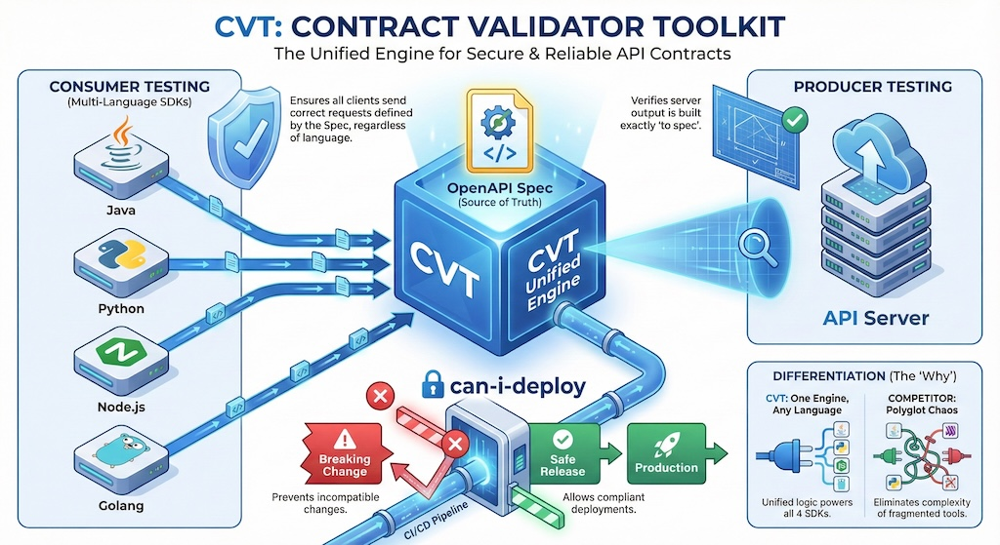

# Contract Validator Toolkit

<p align="center">
  
</p>

A contract validation platform for OpenAPI v2/v3 specifications that validates API requests and responses against your API contract. Supports both consumer-side (client) and producer-side (server) validation.

## Understanding Consumer vs Producer Validation

CVT supports two complementary validation approaches. Understanding when to use each is key to effective contract testing.

```text
┌─────────────────────────────────────────────────────────────────────────────┐
│                           Contract Testing Overview                         │
├─────────────────────────────────────────────────────────────────────────────┤
│  CONSUMER TESTING                                                           │
│                                                                             │
│    ┌──────────────┐                              ┌──────────────┐           │
│    │  Your        │  ──── HTTP Request ────►     │  Downstream  │           │
│    │  Service     │                              │  API         │           │
│    │              │  ◄─── HTTP Response ────     │              │           │
│    └──────────────┘                              └──────────────┘           │
│          │                                              │                   │
│          │ Consumer Validation                          │                   │
│          │ "Am I calling this API correctly?"           │                   │
│          ▼                                              │                   │
│    ┌──────────────┐                                     │                   │
│    │  CVT SDK     │ Validates YOUR outbound calls       │                   │
│    │  (adapter)   │ against THEIR OpenAPI spec          │                   │
│    └──────────────┘                                     │                   │
│                                                         │                   │
├─────────────────────────────────────────────────────────────────────────────┤
│  PRODUCER TESTING                                                           │
│                                                                             │
│  Option A: Runtime Middleware          Option B: Test-Time Validation       │
│  ┌─────────────────────────────┐       ┌─────────────────────────────┐      │
│  │                             │       │                             │      │
│  │  ┌────────┐   ┌──────────┐  │       │  ┌────────┐   ┌──────────┐  │      │
│  │  │ Client │──►│ Your API │  │       │  │  Test  │──►│ Handler  │  │      │
│  │  └────────┘   └────┬─────┘  │       │  └────────┘   └────┬─────┘  │      │
│  │                    │        │       │                    │        │      │
│  │              ┌─────▼─────┐  │       │              ┌─────▼─────┐  │      │
│  │              │ CVT       │  │       │              │ CVT       │  │      │
│  │              │ Middleware│  │       │              │ TestKit   │  │      │
│  │              └───────────┘  │       │              └───────────┘  │      │
│  │                             │       │                             │      │
│  │  Validates live traffic     │       │  Validates handler output   │      │
│  │  "Reject bad requests"      │       │  "Does my code match spec?" │      │
│  └─────────────────────────────┘       └─────────────────────────────┘      │
│                                                                             │
│  Option C: Deployment Safety (can-i-deploy)                                 │
│  ┌──────────────────────────────────────────────────────────────────┐       │
│  │  Before deploying a new schema version, check consumer impact:   │       │
│  │                                                                  │       │
│  │  cvt can-i-deploy --schema my-api --version 2.0.0 --env prod     │       │
│  │                                                                  │       │
│  │  ✓ Query consumer registry    ✓ Detect breaking changes          │       │
│  │  ✓ Identify affected teams    ✓ Block unsafe deployments         │       │
│  └──────────────────────────────────────────────────────────────────┘       │
│                                                                             │
└─────────────────────────────────────────────────────────────────────────────┘
```

### When to Use Each Approach

| Approach                    | You Are...                 | You Want To...                                   | Tool            |
| --------------------------- | -------------------------- | ------------------------------------------------ | --------------- |
| **Consumer Validation**     | Calling another team's API | Validate your HTTP client matches their contract | SDK adapters    |
| **Producer Middleware (A)** | Exposing an API            | Reject invalid requests at runtime               | Middleware      |
| **Producer Testing (B)**    | Exposing an API            | Verify handlers return spec-compliant responses  | ProducerTestKit |
| **Deployment Safety (C)**   | Changing your API          | Ensure changes won't break consumers             | can-i-deploy    |

### Consumer Validation (Client-Side)

**Who uses this:** Teams whose code calls external APIs (e.g., your service calls a payment API, user API, etc.)

**What it validates:** Your HTTP client code—the requests you send and how you handle responses—against the downstream API's OpenAPI specification.

**Where it runs:** In your test suite as contract tests, or as an HTTP client interceptor (Axios, Fetch, Requests) that validates every call automatically.

**When to use it:**

- You're integrating with another team's API
- You want to catch integration bugs before deployment
- You need to test without access to the actual API
- You want to detect when upstream APIs introduce breaking changes

**Key insight:** Consumer validation tests YOUR code against THEIR contract.

```typescript
// Quick example: Validate your API calls match the upstream contract
const result = await validator.validate(
  { method: "GET", path: "/users/123" }, // What your code sends
  { statusCode: 200, body: '{"id": 123}' }, // What the API returns
);
// result.valid === true means your code is contract-compliant
```

### Producer Validation (Server-Side)

CVT offers three complementary approaches for producer-side validation:

#### Option A: Runtime Middleware

**What it does:** Validates incoming requests and outgoing responses against your OpenAPI spec in production.

**When to use:** You want to reject malformed requests before they reach business logic.

```typescript
// Middleware validates ALL incoming requests at runtime
app.use(
  createExpressMiddleware({
    schemaId: "my-api",
    validator,
    mode: "strict", // Rejects requests that don't match your OpenAPI spec
  }),
);
```

#### Option B: Test-Time Validation (ProducerTestKit)

**What it does:** Validates that your handler implementations return spec-compliant responses during testing.

**When to use:** You want to catch implementation drift in your test suite before deployment.

```typescript
// In your test suite - validate handler output matches spec
const testKit = new ProducerTestKit({ schemaId: "my-api" });

const result = await testKit.validateResponse({
  method: "GET",
  path: "/users/123",
  statusCode: 200,
  body: myHandler.getUser("123"), // Your actual handler output
});

expect(result.valid).toBe(true);
```

#### Option C: Deployment Safety (can-i-deploy)

**What it does:** Checks if a new schema version can be safely deployed without breaking registered consumers.

**When to use:** Before deploying API changes to production.

```bash
# Check if v2.0.0 can be deployed without breaking consumers
cvt can-i-deploy --schema my-api --version 2.0.0 --env prod
```

**Key insight:** Producer validation ensures YOUR API matches YOUR contract, and deployment safety prevents breaking THEIR integrations.

## Features

- **OpenAPI v2/v3 Support** - Validate against Swagger 2.0 and OpenAPI 3.0 specifications
- **Consumer Validation** - Validate outgoing API calls match the contract (client-side)
- **Producer Validation** - Validate incoming requests match the contract (server-side middleware)
- **Producer Testing** - Test API handlers against your OpenAPI spec without real consumers
- **Consumer Registry** - Track which consumers depend on which schemas
- **Deployment Safety** - `can-i-deploy` checks prevent breaking changes from reaching production
- **High Performance** - gRPC-based server with schema caching (1000 schemas, 24h TTL)
- **Multiple SDKs** - Node.js, Python, Go, and Java client libraries
- **Security** - TLS/mTLS support and API key authentication
- **Schema Versioning** - Version tracking, content hashing, and breaking change detection
- **Local Lite Mode** - Standalone CLI for validation without Docker
- **Test Fixture Generation** - Generate valid request/response data from schemas
- **CI/CD Integration** - Ready-to-use templates for GitHub Actions, GitLab CI, and Jenkins
- **Observability** - Prometheus metrics and Grafana dashboards built-in
- **Production Ready** - Health checks, structured logging, audit logging, Docker containers (~30-40MB)
- **Fully Tested** - 70%+ code coverage with comprehensive integration tests

## How It Works

CVT validates API contracts through two mechanisms:

- **Consumer testing**: CVT adapters intercept your HTTP client calls and validate them against upstream API contracts
- **Producer testing**: CVT middleware intercepts incoming requests to your API and validates them against your contract

**See [docs/sequence-diagrams.md](docs/sequence-diagrams.md) for detailed sequence diagrams and architecture.**

**Middleware support:** Express, Fastify (Node.js), FastAPI, Flask (Python), net/http, Gin, Chi (Go), Spring, Servlet (Java).

## Validation Modes

CVT producer middleware supports three validation modes for gradual rollout:

| Mode       | Request Violation     | Response Violation | Use Case                      |
| ---------- | --------------------- | ------------------ | ----------------------------- |
| **strict** | Reject with 400       | Log error          | Production enforcement        |
| **warn**   | Log warning, continue | Log warning        | Gradual rollout               |
| **shadow** | Silent (metrics only) | Silent             | Initial deployment, zero risk |

**Recommended rollout:** Start with `shadow` to measure baseline, switch to `warn` to identify issues, then `strict` for full enforcement.

**See [docs/modes.md](docs/modes.md) for detailed mode behavior, SDK configuration examples, and production rollout strategy.**

## Producer Testing & Deployment Safety

CVT provides comprehensive producer-side testing capabilities that help API owners ensure their implementations match their OpenAPI specifications and prevent breaking changes from affecting consumers.

```text
┌─────────────────────────────────────────────────────────────────────────────┐
│                     Consumer Registry & Producer Testing                    │
├─────────────────────────────────────────────────────────────────────────────┤
│                                                                             │
│  CONSUMER SIDE (during tests)              PRODUCER SIDE (before deploy)    │
│  ┌─────────────────────────────┐           ┌─────────────────────────────┐  │
│  │                             │           │                             │  │
│  │  1. Run contract tests      │           │  1. Run schema compliance   │  │
│  │     (validates against      │           │     tests (handler output   │  │
│  │      producer's spec)       │           │      matches spec)          │  │
│  │              │              │           │              │              │  │
│  │              ▼              │           │              ▼              │  │
│  │  2. Register with CVT       │           │  2. Run cvt can-i-deploy    │  │
│  │     - Which schema I use    │           │     - Check breaking changes│  │
│  │     - Which version         │           │     - Check consumer impact │  │
│  │     - Which endpoints/fields│           │              │              │  │
│  │              │              │           │              ▼              │  │
│  │              ▼              │           │  3. Deploy if safe          │  │
│  └──────────────┼──────────────┘           └─────────────────────────────┘  │
│                 │                                        ▲                  │
│                 │         ┌─────────────────────┐        │                  │
│                 └────────►│   CVT Server        │────────┘                  │
│                           │                     │                           │
│                           │  - Consumer Registry│                           │
│                           │  - Schema Store     │                           │
│                           │  - Compatibility    │                           │
│                           │    Matrix           │                           │
│                           └─────────────────────┘                           │
│                                                                             │
└─────────────────────────────────────────────────────────────────────────────┘
```

### Capability Summary

| Capability                    | Needs Registry? | What It Answers                          |
| ----------------------------- | --------------- | ---------------------------------------- |
| **Schema compliance tests**   | No              | "Does my code match my spec?"            |
| **Breaking change detection** | No              | "What changed between v1 and v2?"        |
| **can-i-deploy**              | **Yes**         | "Will this change break real consumers?" |
| **Consumer impact analysis**  | **Yes**         | "Which teams do I need to notify?"       |

### Producer Testing (ProducerTestKit)

Test your API handlers return spec-compliant responses without needing real consumers:

```typescript
// Node.js
import { ProducerTestKit } from "@cvt/cvt-sdk/producer";

const testKit = new ProducerTestKit({
  schemaId: "user-api",
  serverAddress: "localhost:50051",
});

// In your test
const result = await testKit.validateResponse({
  method: "GET",
  path: "/users/123",
  statusCode: 200,
  body: { id: "123", name: "John", email: "john@example.com" },
});

expect(result.valid).toBe(true);
```

```go
// Go
testKit, _ := producer.NewProducerTestKit(producer.TestConfig{
    SchemaID:      "user-api",
    ServerAddress: "localhost:50051",
})

result, _ := testKit.ValidateResponse(ctx, producer.ValidateResponseParams{
    Method:     "GET",
    Path:       "/users/123",
    StatusCode: 200,
    Body:       map[string]interface{}{"id": "123", "name": "John"},
})

assert.True(t, result.Valid)
```

### Consumer Registry

Track which consumers depend on which schemas for deployment safety analysis:

```typescript
// Register a consumer's dependency on a schema
await validator.registerConsumer({
  consumerId: "order-service",
  consumerVersion: "2.1.0",
  schemaId: "user-api",
  schemaVersion: "1.0.0",
  environment: "prod",
  usedEndpoints: [
    { method: "GET", path: "/users/{id}", usedFields: ["email", "name"] },
  ],
});

// List all consumers of a schema
const consumers = await validator.listConsumers("user-api", "prod");
```

### Deployment Safety (can-i-deploy)

Check if a schema version can be safely deployed without breaking consumers:

```bash
# CLI usage
cvt can-i-deploy --schema user-api --version 2.0.0 --env prod

# Output (when unsafe)
❌ UNSAFE TO DEPLOY

Breaking changes in v2.0.0:
  - FIELD_REMOVED: GET /users/{id} response removed 'email'

Affected consumers in production:
  ├── order-service v2.1.0
  │   Schema version: 1.0.0
  │   Impact: BREAKING
  │   Affected by:
  │     - GET /users/{id}
  │
  └── billing-service v1.0.0
      Schema version: 1.0.0
      Impact: None

Safe consumers:     1/2
Affected consumers: 1/2

Recommendation: Coordinate with order-service team before deploying.
```

```typescript
// SDK usage
const result = await validator.canIDeploy("user-api", "2.0.0", "prod");
if (!result.safeToDeploy) {
  console.log("Affected consumers:", result.affectedConsumers);
  process.exit(1);
}
```

**See [docs/producer-testing.md](docs/producer-testing.md) for complete producer testing documentation.**

## Quick Start

```bash
# 1. Start CVT server + Prometheus + Grafana
make up

# 2. Verify gRPC server is accepting connections
make health

# 3. Run Node.js SDK example to see validation in action
make run-example

# 4. Stop all containers
make down
```

### Consumer Validation (Client SDK)

Validate your HTTP client calls against the API contract:

```javascript
const { ContractValidator } = require("@cvt/cvt-sdk");

const validator = new ContractValidator("localhost:50052");
await validator.registerSchema("my-api", "./openapi.json");

// Validate request/response pair against the registered schema
const result = await validator.validate(
  { method: "GET", path: "/users", headers: {} }, // What your code sends
  { statusCode: 200, body: '[{"id": 1}]' }, // What the API returns
);

console.log(result.valid ? "✅ Valid" : "❌ Invalid");
```

### Producer Validation (Server Middleware)

Validate incoming requests to your API server:

```javascript
// Express.js example
import express from "express";
import { ContractValidator } from "@cvt/cvt-sdk";
import { createExpressMiddleware } from "@cvt/cvt-sdk/producer";

const validator = new ContractValidator("localhost:50052");
await validator.registerSchema("my-api", "./openapi.json");

const app = express();
// Middleware validates ALL incoming requests before they hit your routes
app.use(
  createExpressMiddleware({
    schemaId: "my-api",
    validator,
    mode: "strict", // "strict" rejects invalid requests; "warn" logs only
  }),
);
```

---

## User Guide

This section walks you through common use cases from start to finish.

**Use Cases:**

| Use Case                          | Description                                                | Link                                                                                                      |
| --------------------------------- | ---------------------------------------------------------- | --------------------------------------------------------------------------------------------------------- |
| **1. Adding Contract Tests**      | Validate your HTTP calls match upstream API contracts      | [docs/use-cases.md#use-case-1](docs/use-cases.md#use-case-1-adding-contract-tests-to-your-service)        |
| **2. Detecting Breaking Changes** | Ensure API updates don't break existing consumers          | [docs/use-cases.md#use-case-2](docs/use-cases.md#use-case-2-detecting-breaking-changes-before-deployment) |
| **3. Local Development**          | Fast feedback without Docker using CLI or embedded library | [docs/use-cases.md#use-case-3](docs/use-cases.md#use-case-3-validating-during-development-local-workflow) |
| **4. Testing Without API Access** | Validate integration code before you have API access       | [docs/use-cases.md#use-case-4](docs/use-cases.md#use-case-4-testing-without-api-access)                   |
| **5. Producer Validation**        | Validate incoming requests to your API with middleware     | [docs/use-cases.md#use-case-5](docs/use-cases.md#use-case-5-producer-side-api-validation)                 |

**See [docs/use-cases.md](docs/use-cases.md) for complete step-by-step guides with code examples.**

---

### CI/CD Integration

CVT provides ready-to-use templates for integrating contract validation into your CI/CD pipelines.

#### GitHub Actions

```yaml
# .github/workflows/contract-validation.yml
name: Contract Validation
on: [push, pull_request]

jobs:
  validate:
    runs-on: ubuntu-latest
    steps:
      - uses: actions/checkout@v4
      - uses: your-org/cvt/.github/actions/cvt-validate@main
        with:
          schema-path: "./openapi.json"
          validate-fixtures: "tests/fixtures/*.json"
```

#### GitLab CI

```yaml
# .gitlab-ci.yml
include:
  - project: "your-org/cvt"
    file: "/ci-templates/gitlab-ci.yml"

variables:
  CVT_SCHEMA_PATH: "openapi.json"
```

#### Jenkins

Copy `ci-templates/Jenkinsfile` to your repository, or use as a shared library.

**Full documentation:** See [`ci-templates/README.md`](ci-templates/README.md) for complete setup instructions, all available options, and troubleshooting.

---

### Adoption Checklist

Use this checklist when adopting CVT for your service:

- [ ] **Identify upstream dependencies** - List all APIs your service calls
- [ ] **Collect OpenAPI schemas** - Get schemas from each upstream service
- [ ] **Create contracts directory** - Store schemas in `./contracts/` or `./api/`
- [ ] **Install CVT SDK** - Add the SDK for your language
- [ ] **Write first contract test** - Start with your most critical integration
- [ ] **Add HTTP adapter** - Enable automatic validation for all calls
- [ ] **Add to CI pipeline** - Ensure tests run on every PR
- [ ] **Set up breaking change detection** - If you own an API, add schema comparison

### Troubleshooting Common Issues

| Issue                      | Solution                                                           |
| -------------------------- | ------------------------------------------------------------------ |
| "Connection refused"       | Ensure CVT server is running: `make up` or `docker ps`             |
| "Schema not found"         | Check schema ID matches between register and validate              |
| "Validation timeout"       | Increase timeout or check network connectivity                     |
| "Path not found in schema" | Verify the path exists in your OpenAPI spec                        |
| "Invalid response body"    | Check JSON structure matches schema; use `--json` flag for details |

---

### SDK Adapters

CVT provides adapters for both consumer (client-side) and producer (server-side) validation.

#### Consumer Adapters (Client-Side)

Automatically validate outgoing HTTP calls:

```javascript
// Node.js - Axios adapter wraps your client for automatic validation
const adapter = createAxiosAdapter({
  axios: api,
  validator,
  schemaId: "my-api",
});
const response = await api.post("/pets", { name: "Fluffy" }); // Auto-validated!
```

```python
# Python - Drop-in replacement for requests.Session with validation
session = ContractValidatingSession(validator, schema_id='my-api')
response = session.post('http://api/pets', json={'name': 'Fluffy'})  # Auto-validated!
```

```go
// Go - RoundTripper intercepts all HTTP traffic for validation
rt := adapters.NewValidatingRoundTripper(adapters.RoundTripperConfig{Validator: v})
client := &http.Client{Transport: rt}
```

#### Producer Middleware (Server-Side)

Validate incoming requests to your API:

```javascript
// Node.js - Express middleware validates before routes execute
import { createExpressMiddleware } from "@cvt/cvt-sdk/producer";
app.use(
  createExpressMiddleware({ schemaId: "my-api", validator, mode: "strict" }),
);
```

```python
# Python - ASGI middleware for FastAPI/Starlette
from cvt_sdk.producer.adapters import ASGIMiddleware
app.add_middleware(ASGIMiddleware, config=config)
```

```go
// Go - Middleware wrapper for any http.Handler
import "github.com/cvt/cvt-sdk/go/cvt/producer/adapters"
http.Handle("/", adapters.NetHTTPMiddleware(config)(handler))
```

```java
// Java - Spring interceptor for controller methods
registry.addInterceptor(new SpringInterceptor(config)).addPathPatterns("/api/**");
```

See [Use Case 5: Producer-Side API Validation](docs/use-cases.md#use-case-5-producer-side-api-validation) for complete producer validation documentation.

### Security Configuration

```javascript
// Enable TLS encryption and API key auth for production deployments
const validator = new ContractValidator({
  address: "localhost:50051",
  tls: { enabled: true, rootCertPath: "./certs/ca.crt" }, // mTLS supported
  apiKey: "your-api-key", // Set via CVT_API_KEYS env var on server
});
```

### CLI (Local Lite Mode)

Validate schemas locally without Docker:

```bash
# Build the CLI (one-time)
go build -o cvt ./cmd/cvt

# Validate request/response against schema
cvt validate --schema ./openapi.json --request req.json --response resp.json

# Detect breaking changes between schema versions (exit code 1 = breaking)
cvt compare --old ./v1/openapi.json --new ./v2/openapi.json

# Run standalone gRPC server (alternative to Docker)
cvt serve --port 50051
```

## Project Structure

```shell
/
├── api/          # Protobuf definitions
├── cmd/cvt/      # CLI commands (validate, compare, serve)
├── pkg/cvt/      # Embedded validation library
├── server/       # Go gRPC server (~1200 lines of tests)
├── sdks/         # Client SDKs (Node.js, Python, Go, Java)
│   ├── shared/   # Test schemas (openapi.json, swagger.json)
│   └── */        # Language-specific SDKs with examples
├── observability/  # Prometheus & Grafana configs
├── docs/         # Documentation
└── tools/        # Build scripts
```

## Prerequisites

- **Docker & Docker Compose** (required)
- **Node.js 18+** (for Node.js SDK)
- **Optional**: Go 1.25+, Python 3.11+, grpc-health-probe

Install health probe: `make install-health-probe` or see [releases](https://github.com/grpc-ecosystem/grpc-health-probe/releases)

## Key Commands

```bash
# Docker
make up                    # Start server + observability
make down                  # Stop all services
make logs                  # View server logs

# Testing
make test                  # Run all tests
make test-with-observability  # Run tests, keep stack running

# Health & Observability
make health                # Check server health
make grafana               # Open Grafana (localhost:3000)
make metrics               # View Prometheus metrics

# Development
make build                 # Build server and SDKs
make run-example           # Run Node.js example
```

**See all commands**: `make help`

## Observability

Built-in **Prometheus metrics** and **Grafana dashboards**:

```bash
# Start with observability stack
make up

# Access dashboards
# - Grafana:    http://localhost:3000 (admin/admin)
# - Prometheus: http://localhost:9091
# - Metrics:    http://localhost:9090/metrics
```

**Metrics**: Validation counts/latency, cache hit rates, schema registrations, gRPC request patterns

**See [docs/OBSERVABILITY.md](docs/OBSERVABILITY.md) for detailed metrics reference and dashboard configuration.**

## Architecture

**Server** (Go 1.25): gRPC API with kin-openapi validation, Ristretto caching (1000 schemas/24h), Prometheus metrics, structured logging (Zap)

- **Ports**: 50051 (gRPC), 9090 (metrics)
- **Container**: Alpine-based, ~30-40MB, non-root user

**SDKs**: Node.js (production-ready), Python, Go, Java

- All SDKs support schema registration and validation
- Examples included in `sdks/*/examples/`

**See detailed docs**: [server/README.md](server/README.md), [sdks/node/README.md](sdks/node/README.md), [sdks/python/README.md](sdks/python/README.md), [sdks/go/README.md](sdks/go/README.md), [sdks/java/README.md](sdks/java/README.md)

## Development

```bash
# Code generation (after modifying api/protos)
make generate

# Run tests
make test                 # All tests (server + SDKs)
make test-server          # Server unit tests only
make test-integration     # Integration tests (requires Docker)

# Coverage
cd server && go test -coverprofile=coverage.out ./...
go tool cover -html=coverage.out -o coverage.html
```

**Testing**: 1200+ lines of Go tests, 70%+ coverage enforced in CI/CD

**See detailed guides**: [server/README.md](server/README.md) for server development, SDK READMEs for client library testing

## Troubleshooting

```bash
# Server won't start
lsof -i :50052           # Check if port is in use
make logs                # View error logs

# Tests failing
make clean && make build # Clean rebuild
cd server && go test -v ./...  # Verbose test output

# Schema registration fails
# - Validate schema at editor.swagger.io
# - Check schema size (10MB max)
# - Verify network connectivity
```

## CI/CD & Quality

**GitHub Actions**: Automated testing, building, security scanning (Trivy), linting (golangci-lint, ESLint)

- Server: Go 1.25, race detection, 70% coverage minimum
- Integration tests with Docker
- Multi-stage Docker builds (~30-40MB images)

## Performance & Security

**Performance Targets**:

- **Throughput**: 5000+ validations/sec (Design goal)
- **Startup**: <1s (Typical for Go gRPC)
- **Footprint**: 50-100MB memory, ~30-40MB Docker image
- **Efficiency**: 1000 schema cache with 24h TTL (Ristretto)

**Security**:

- ✅ TLS/mTLS support for encrypted transport
- ✅ API key authentication with configurable key store
- ✅ Input validation, non-root containers, bounded caching
- ✅ Audit logging for compliance and governance
- ✅ 70%+ code coverage (Enforced in CI/CD)
- ⚠️ **Production needs**: Rate limiting (not yet implemented)

**Optimization**: Reuse schemas, batch validations, monitor cache hit rates via Grafana.

## Documentation

**Getting Started:**

- [User Guide](#user-guide) - End-to-end use cases and adoption checklist
- [ROADMAP.md](ROADMAP.md) - Technical roadmap and planned features
- [docs/adoption-strategy.md](docs/adoption-strategy.md) - Organizational adoption guide

**Guides:**

- [docs/use-cases.md](docs/use-cases.md) - Step-by-step guides for common scenarios
- [docs/producer-testing.md](docs/producer-testing.md) - Producer testing and deployment safety
- [docs/modes.md](docs/modes.md) - Validation modes (strict/warn/shadow) and rollout strategy
- [docs/sequence-diagrams.md](docs/sequence-diagrams.md) - Architecture and flow diagrams

**Technical References:**

- [docs/OBSERVABILITY.md](docs/OBSERVABILITY.md) - Metrics and monitoring guide
- [docs/DEVELOPMENT.md](docs/DEVELOPMENT.md) - Development setup and guidelines
- [server/README.md](server/README.md) - Server architecture and development
- [sdks/node/README.md](sdks/node/README.md) - Node.js SDK guide
- [sdks/python/README.md](sdks/python/README.md) - Python SDK guide
- [sdks/go/README.md](sdks/go/README.md) - Go SDK guide
- [sdks/java/README.md](sdks/java/README.md) - Java SDK guide

**Contributing:**

- [CONTRIBUTING.md](CONTRIBUTING.md) - How to contribute
- [CODEOWNERS](CODEOWNERS) - Code ownership model

## Comparison & Value Proposition

CVT is not just another validation library; it is an architectural answer to the inconsistencies of polyglot microservices.

| Approach                      | Examples                              | The Problem                                                                                                                                | How CVT differs                                                                                                                         |
| :---------------------------- | :------------------------------------ | :----------------------------------------------------------------------------------------------------------------------------------------- | :-------------------------------------------------------------------------------------------------------------------------------------- |
| **In-Process Libraries**      | `Ajv` (Node), `swagger-parser` (Java) | **Inconsistency:** A regex might pass in Node.js but fail in Java. Teams fighting "works on my machine" issues due to runtime differences. | **Unified Engine:** One Go-based validator governs rules for _all_ languages. If it passes in Python, it guarantees passing in Java.    |
| **Consumer-Driven Contracts** | `Pact`                                | **Complexity:** Requires generating/brokering separate "pact files" and heavy coordination between teams.                                  | **Simplicity:** Uses your _existing_ OpenAPI spec as the "Golden Source." No new artifacts to manage, just pure compliance checking.    |
| **Runtime Gateways**          | `Kong`, `Apigee`                      | **Too Late:** Validation happens at deployment/runtime.                                                                                    | **Shift Left:** CVT runs directly in your local test suite (Jest, JUnit) via Docker, catching contract violations _during development_. |

**Architectural Trade-off:**
CVT exchanges the _simplicity_ of a library import for the _consistency_ of a containerized service. While it requires Docker to run tests, it buys you absolute certainty that your API implementation matches the design contract across your entire organization.

## License

MIT License - see LICENSE file for details

---

**Built with**: [gRPC](https://grpc.io/), [kin-openapi](https://github.com/getkin/kin-openapi), [Ristretto](https://github.com/dgraph-io/ristretto), [Zap](https://github.com/uber-go/zap)
