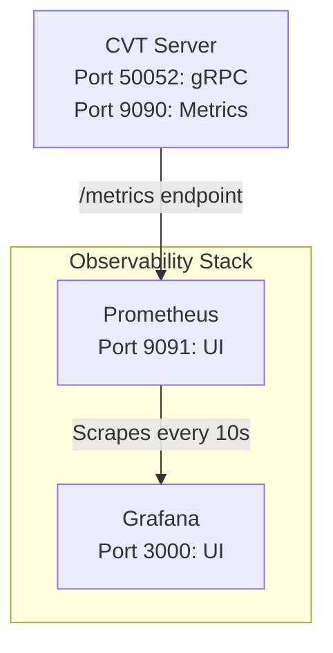

# CVT Observability Guide

This document describes the observability features available in the Contract Validator Toolkit (CVT), including metrics, monitoring, and dashboards.

## Overview

CVT provides comprehensive observability through:

- **Prometheus Metrics**: Real-time metrics collection and storage
- **Grafana Dashboards**: Visual monitoring and analytics
- **Structured Logging**: Detailed operation logs with Zap logger

## Architecture



> **Note**: Internal container port for gRPC is 50051, mapped to host port 50052.

## Quick Start

### Start the Observability Stack

```bash
# Start CVT server, Prometheus, and Grafana
make up

# Check status
make observability-status
```

### Access the UIs

- **Grafana**: <http://localhost:3000> (admin/admin)
- **Prometheus**: <http://localhost:9091>
- **Metrics Endpoint**: <http://localhost:9090/metrics>

### Quick Commands

```bash
# View metrics in terminal
make metrics

# Open Grafana dashboard
make grafana

# Open Prometheus UI
make prometheus

# View observability logs
make observability-logs
```

## Metrics Collected

### Schema Registration Metrics

| Metric | Type | Labels | Description |
|--------|------|--------|-------------|
| `cvt_schemas_registered_total` | Counter | `status` (success/failure) | Total number of schemas registered |
| `cvt_schema_registration_errors_total` | Counter | `error_type` | Schema registration errors by type |

### Validation Metrics

| Metric | Type | Labels | Description |
|--------|------|--------|-------------|
| `cvt_validations_total` | Counter | `schema_id`, `method`, `result` | Total validations performed |
| `cvt_validation_duration_seconds` | Histogram | `schema_id`, `method` | Validation operation duration |
| `cvt_validation_errors_total` | Counter | `error_category` | Validation errors by category |

**Error Categories:**

- `input_validation`: Invalid request parameters
- `schema_not_found`: Schema not found in cache
- `request_invalid`: HTTP request validation failed
- `response_invalid`: HTTP response validation failed
- `route_not_found`: Route not found in OpenAPI spec

### Cache Metrics

| Metric | Type | Description |
|--------|------|-------------|
| `cvt_cache_hits_total` | Counter | Total cache hits |
| `cvt_cache_misses_total` | Counter | Total cache misses |
| `cvt_cache_size_bytes` | Gauge | Current cache size in bytes |
| `cvt_cache_items_total` | Gauge | Current number of cached items |

### gRPC Metrics

| Metric | Type | Labels | Description |
|--------|------|--------|-------------|
| `cvt_grpc_requests_total` | Counter | `method`, `status` | Total gRPC requests |
| `cvt_grpc_request_duration_seconds` | Histogram | `method` | gRPC request duration |

**Methods:**

- `RegisterSchema`
- `ValidateInteraction`

## Grafana Dashboard

The CVT Grafana dashboard provides real-time visualization of:

### Panels

1. **Validations per Second** (Stat)
   - Current rate of validations
   - Threshold indicators for performance

2. **Validation Results Over Time** (Time Series)
   - Valid vs Invalid vs Error validations
   - Trends and patterns

3. **Validation Latency (Percentiles)** (Time Series)
   - p50, p95, p99 latency
   - Performance SLOs

4. **Cache Hit Rate** (Gauge)
   - Visual indicator of cache effectiveness
   - Color-coded thresholds:
     - Red: < 50%
     - Yellow: 50-80%
     - Green: > 80%

5. **Validation Errors by Category** (Time Series)
   - Error distribution over time
   - Helps identify problem areas

6. **gRPC Requests by Method** (Time Series)
   - Request distribution
   - Usage patterns

7. **Summary Stats** (Stats)
   - Total Schemas Registered
   - Cache Hits/sec
   - Cache Misses/sec

### Accessing the Dashboard

1. Open Grafana: <http://localhost:3000>
2. Login with `admin` / `admin`
3. Navigate to Dashboards → CVT - Contract Validator Toolkit

## Prometheus Configuration

The Prometheus configuration scrapes metrics from the CVT server every 10 seconds:

```yaml
scrape_configs:
  - job_name: 'cvt-server'
    scrape_interval: 10s
    static_configs:
      - targets: ['cvt-server:9090']
```

### Useful Prometheus Queries

#### Validation Rate

```promql
sum(rate(cvt_validations_total[5m]))
```

#### Cache Hit Rate

```promql
sum(rate(cvt_cache_hits_total[5m])) /
(sum(rate(cvt_cache_hits_total[5m])) + sum(rate(cvt_cache_misses_total[5m])))
```

#### p95 Latency

```promql
histogram_quantile(0.95, sum(rate(cvt_validation_duration_seconds_bucket[5m])) by (le))
```

#### Error Rate by Category

```promql
sum by (error_category) (rate(cvt_validation_errors_total[5m]))
```

## Custom Metrics Endpoint

The CVT server exposes a Prometheus-compatible `/metrics` endpoint on port 9090:

```bash
curl http://localhost:9090/metrics
```

### Example Output

```text
# HELP cvt_validations_total Total number of validations performed
# TYPE cvt_validations_total counter
cvt_validations_total{method="POST",result="valid",schema_id="petstore-v3"} 42

# HELP cvt_validation_duration_seconds Duration of validation operations in seconds
# TYPE cvt_validation_duration_seconds histogram
cvt_validation_duration_seconds_bucket{le="0.001",method="POST",schema_id="petstore-v3"} 10
cvt_validation_duration_seconds_bucket{le="0.005",method="POST",schema_id="petstore-v3"} 35
```

## Structured Logging

CVT uses [Zap](https://github.com/uber-go/zap) for structured logging.

### Log Levels

Set via `LOG_LEVEL` environment variable:

- `debug`: Verbose logging (development)
- `info`: Standard logging (production)
- `warn`: Warnings only
- `error`: Errors only

### Example Logs

```json
{
  "level": "info",
  "ts": 1638360000.123,
  "caller": "server/validator_service.go:110",
  "msg": "Schema registered successfully",
  "schemaId": "petstore-v3"
}

{
  "level": "info",
  "ts": 1638360001.456,
  "caller": "server/validator_service.go:237",
  "msg": "Interaction validated successfully",
  "schemaId": "petstore-v3",
  "method": "POST",
  "path": "/pets"
}
```

## Production Deployment

### Recommended Configuration

```yaml
# docker-compose.yml
services:
  cvt-server:
    environment:
      - LOG_LEVEL=info
      - CVT_PORT=50051
      - CVT_METRICS_PORT=9090

  prometheus:
    volumes:
      - prometheus-data:/prometheus
    restart: unless-stopped

  grafana:
    volumes:
      - grafana-data:/var/lib/grafana
    environment:
      - GF_SECURITY_ADMIN_PASSWORD=${GRAFANA_PASSWORD}
    restart: unless-stopped
```

### Security Considerations

1. **Change default credentials**: Update Grafana admin password
2. **Network isolation**: Use Docker networks to isolate services
3. **TLS encryption**: Enable HTTPS for Grafana in production
4. **Authentication**: Configure Grafana OAuth or LDAP
5. **Firewall rules**: Restrict access to metrics and monitoring ports

### Retention and Storage

- **Prometheus**: Default retention is 15 days
- **Grafana**: Stores dashboard configurations only
- **Metrics cardinality**: Monitor label cardinality to prevent explosion

```yaml
# Increase Prometheus retention
prometheus:
  command:
    - '--storage.tsdb.retention.time=30d'
    - '--storage.tsdb.retention.size=10GB'
```

## Alerting

### Sample Alert Rules

Create `observability/alert-rules.yml`:

```yaml
groups:
  - name: cvt_alerts
    interval: 30s
    rules:
      - alert: HighErrorRate
        expr: sum(rate(cvt_validation_errors_total[5m])) > 10
        for: 5m
        labels:
          severity: warning
        annotations:
          summary: High validation error rate
          description: Error rate is {{ $value }} errors/sec

      - alert: LowCacheHitRate
        expr: |
          sum(rate(cvt_cache_hits_total[5m])) /
          (sum(rate(cvt_cache_hits_total[5m])) + sum(rate(cvt_cache_misses_total[5m]))) < 0.5
        for: 10m
        labels:
          severity: warning
        annotations:
          summary: Cache hit rate is low
          description: Cache hit rate is {{ $value | humanizePercentage }}

      - alert: HighLatency
        expr: histogram_quantile(0.95, sum(rate(cvt_validation_duration_seconds_bucket[5m])) by (le)) > 0.1
        for: 5m
        labels:
          severity: warning
        annotations:
          summary: High validation latency
          description: p95 latency is {{ $value }}s
```

## Troubleshooting

### Metrics Not Appearing

1. Check CVT server is running:

   ```bash
   make status
   ```

2. Verify metrics endpoint is accessible:

   ```bash
   curl http://localhost:9090/metrics
   ```

3. Check Prometheus is scraping:
   - Open <http://localhost:9091>
   - Go to Status → Targets
   - Verify `cvt-server` target is UP

### Grafana Dashboard Not Loading

1. Check Grafana is running:

   ```bash
   docker ps | grep grafana
   ```

2. Verify datasource configuration:
   - Open <http://localhost:3000>
   - Go to Configuration → Data Sources
   - Verify Prometheus is configured and working

3. Check logs:

   ```bash
   make observability-logs
   ```

### High Memory Usage

Monitor cache size and adjust configuration in `server/cache.go`:

```go
const (
    MaxSchemas = 1000  // Reduce if memory is constrained
    SchemaTTL = 24 * time.Hour  // Reduce to free memory faster
)
```

## Further Reading

- [Prometheus Best Practices](https://prometheus.io/docs/practices/)
- [Grafana Dashboards](https://grafana.com/docs/grafana/latest/dashboards/)
- [OpenTelemetry](https://opentelemetry.io/) (future enhancement)
- [Zap Logging](https://github.com/uber-go/zap)
