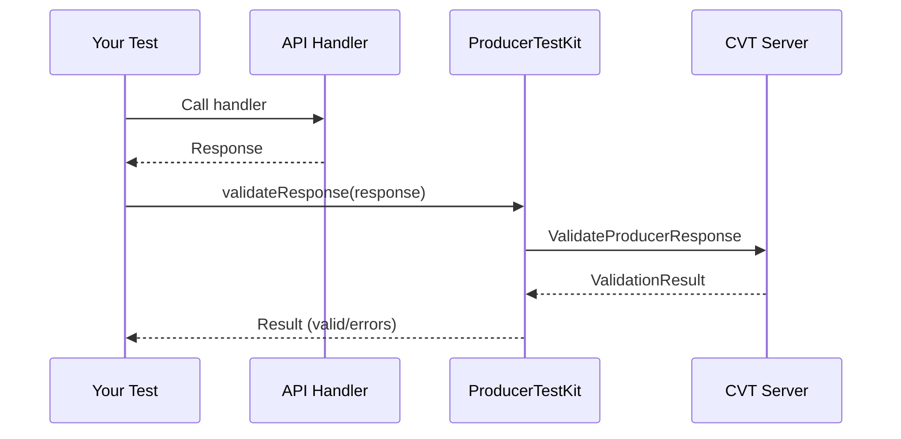
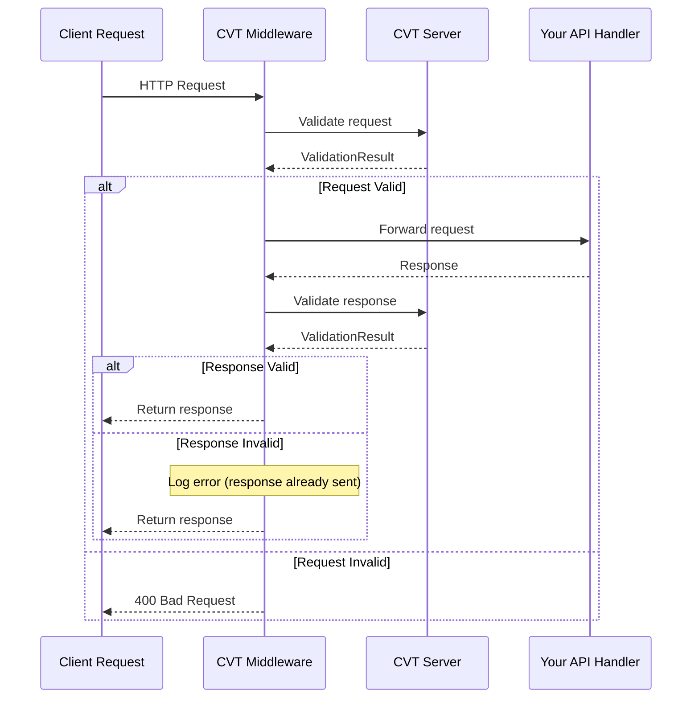

# Producer Testing Guide

**CONTENT TO BE VALIDATED**

This guide covers how to use CVT for producer-side contract testing. Producer testing ensures your API implementation matches your OpenAPI specification before deployment.

## Overview

Producer testing answers the question: **"Does my API match my spec?"**

| Approach             | Who Uses It   | What It Tests                    |
| -------------------- | ------------- | -------------------------------- |
| **Consumer Testing** | API consumers | "Can I call this API correctly?" |
| **Producer Testing** | API producers | "Does my API match my spec?"     |

```text
┌─────────────────────┐     HTTP      ┌─────────────────────┐
│   Client Requests   │ ────────────► │   Your API Server   │
└─────────────────────┘               │   + CVT Middleware  │
                                      └─────────────────────┘
                                               │
                                               │ Validate
                                               ▼
                                      ┌─────────────────────┐
                                      │    CVT Server       │
                                      │    + Your Schema    │
                                      └─────────────────────┘
```

---

## Capabilities

| Capability                    | Server Required? | What It Answers                                    |
| ----------------------------- | ---------------- | -------------------------------------------------- |
| **Schema compliance tests**   | Yes              | "Does my handler return spec-compliant responses?" |
| **Breaking change detection** | No (CLI)         | "What changed between v1 and v2 of my spec?"       |
| **Consumer registry**         | Yes              | "Which services depend on my API?"                 |
| **can-i-deploy**              | Yes              | "Will this change break real consumers?"           |

---

## Schema Compliance Testing

Schema compliance testing validates that your API handlers return responses matching your OpenAPI specification.

### How It Works



1. Register your OpenAPI schema with CVT server
2. Call your handler with test data
3. Validate the response against the schema
4. Get detailed error messages for any mismatches

### Node.js Example

```typescript
import { ProducerTestKit } from "@cvt/cvt-sdk/producer";

describe("User API", () => {
  let testKit: ProducerTestKit;

  beforeAll(async () => {
    testKit = new ProducerTestKit({
      schemaId: "user-api",
      serverAddress: "localhost:9550",
    });
  });

  afterAll(async () => {
    await testKit.close();
  });

  it("GET /users/:id returns valid response", async () => {
    // Call your actual handler
    const response = await userHandler.getUser("123");

    // Validate against schema
    const result = await testKit.validateResponse({
      method: "GET",
      path: "/users/123",
      statusCode: 200,
      body: response,
    });

    expect(result.valid).toBe(true);
    expect(result.errors).toHaveLength(0);
  });

  it("detects missing required fields", async () => {
    const result = await testKit.validateResponse({
      method: "GET",
      path: "/users/123",
      statusCode: 200,
      body: { id: "123" }, // missing 'name' field
    });

    expect(result.valid).toBe(false);
    expect(result.errors[0]).toContain("name");
  });
});
```

### Go Example

```go
func TestUserHandler(t *testing.T) {
    testKit, err := producer.NewProducerTestKit(producer.TestConfig{
        SchemaID:      "user-api",
        ServerAddress: "localhost:9550",
    })
    require.NoError(t, err)
    defer func() { _ = testKit.Close() }()

    t.Run("GET /users/:id returns valid response", func(t *testing.T) {
        // Call your handler
        resp := userHandler.GetUser(ctx, "123")

        // Validate
        result, err := testKit.ValidateResponse(ctx, producer.ValidateResponseParams{
            Method:     "GET",
            Path:       "/users/123",
            StatusCode: 200,
            Body:       resp,
        })

        require.NoError(t, err)
        assert.True(t, result.Valid)
    })
}
```

### Python Example

```python
import pytest
from cvt_sdk.producer import ProducerTestKit, TestConfig

@pytest.fixture
def test_kit():
    kit = ProducerTestKit(TestConfig(
        schema_id="user-api",
        server_address="localhost:9550",
    ))
    yield kit
    kit.close()

def test_get_user_returns_valid_response(test_kit, user_handler):
    # Call your handler
    response = user_handler.get_user("123")

    # Validate
    result = test_kit.validate_response(
        method="GET",
        path="/users/123",
        status_code=200,
        body=response,
    )

    assert result.valid
    assert len(result.errors) == 0
```

### Java Example

```java
public class UserHandlerTest {
    private ProducerTestKit testKit;

    @BeforeEach
    void setup() {
        testKit = ProducerTestKit.builder()
            .schemaId("user-api")
            .serverAddress("localhost:9550")
            .build();
    }

    @AfterEach
    void teardown() {
        testKit.close();
    }

    @Test
    void getUserReturnsValidResponse() {
        // Call your handler
        var response = userHandler.getUser("123");

        // Validate
        var result = testKit.validateResponse(
            "GET",
            "/users/123",
            TestResponseData.builder()
                .statusCode(200)
                .body(response)
                .build()
        );

        assertTrue(result.isValid());
        assertTrue(result.getErrors().isEmpty());
    }
}
```

---

## Producer Middleware

For runtime validation, add CVT middleware to your HTTP server.

### How Middleware Works



### Node.js (Express)

```typescript
import { createExpressMiddleware } from "@cvt/cvt-sdk/producer";

app.use(
  createExpressMiddleware({
    schemaId: "my-api",
    validator,
    mode: "strict", // or 'warn' or 'shadow'
  }),
);
```

### Node.js (Fastify)

```typescript
import { createFastifyPlugin } from "@cvt/cvt-sdk/producer";

fastify.register(createFastifyPlugin({ schemaId: "my-api", validator }));
```

### Go (net/http)

```go
import "github.com/sahina/cvt/sdks/go/cvt/producer/adapters"

config := producer.Config{
    SchemaID:  "my-api",
    Validator: validator,
    Mode:      producer.ModeStrict,
}
http.Handle("/", adapters.NetHTTPMiddleware(config)(myHandler))
```

### Go (Gin)

```go
router := gin.Default()
router.Use(adapters.GinMiddleware(config))
```

### Python (FastAPI)

```python
from cvt_sdk.producer import ProducerConfig, ValidationMode
from cvt_sdk.producer.adapters import ASGIMiddleware

config = ProducerConfig(
    schema_id="my-api",
    validator=validator,
    mode=ValidationMode.STRICT,
)
app.add_middleware(ASGIMiddleware, config=config)
```

### Python (Flask)

```python
from cvt_sdk.producer.adapters import WSGIMiddleware

app.wsgi_app = WSGIMiddleware(app.wsgi_app, config=config)
```

### Java (Spring)

```java
registry.addInterceptor(new SpringInterceptor(config))
    .addPathPatterns("/api/**");
```

### Path Filtering

Exclude health checks, metrics, or other paths from validation:

```typescript
createExpressMiddleware({
  schemaId: "my-api",
  validator,
  mode: "strict",
  excludePaths: ["/health", "/metrics", "/ready"],
  includePaths: ["/api/**"],
});
```

---

## Validation Modes

See [Validation Modes](./validation-modes.md) for detailed information.

| Mode       | Request Violation | Response Violation | Use Case               |
| ---------- | ----------------- | ------------------ | ---------------------- |
| **strict** | Reject with 400   | Log error          | Production enforcement |
| **warn**   | Log, continue     | Log, continue      | Gradual rollout        |
| **shadow** | Silent            | Silent             | Initial deployment     |

### Recommended Rollout

```text
Deploy with SHADOW → Analyze metrics → Switch to WARN → Fix issues → Switch to STRICT
```

---

## Consumer Registry

Track which services depend on your API.

### Listing Your Consumers

```typescript
const consumers = await validator.listConsumers({
  schemaId: "user-api",
  environment: "prod",
});

console.log(`${consumers.length} services depend on user-api in prod`);
for (const consumer of consumers) {
  console.log(`- ${consumer.consumerId} v${consumer.consumerVersion}`);
}
```

### Understanding Consumer Registrations

Consumers register after their contract tests pass:

```typescript
// A consumer (not you) registers like this:
await validator.registerConsumer({
  consumerId: "order-service",
  consumerVersion: "2.1.0",
  schemaId: "user-api", // Your API
  schemaVersion: "1.0.0",
  environment: "prod",
  usedEndpoints: [
    {
      method: "GET",
      path: "/users/{id}",
      usedFields: ["id", "email", "name"],
    },
  ],
});
```

This tells you:

- `order-service` depends on your API
- They use `GET /users/{id}`
- They specifically need the `id`, `email`, and `name` fields

---

## Deployment Safety (can-i-deploy)

Before deploying a new schema version, check if it will break any consumers.

### CLI Usage

```bash
# Check if v2.0.0 can be deployed to production
cvt can-i-deploy --schema user-api --version 2.0.0 --env prod

# JSON output for CI/CD
cvt can-i-deploy --schema user-api --version 2.0.0 --env prod --json
```

### SDK Usage

```typescript
const result = await validator.canIDeploy({
  schemaId: "user-api",
  newVersion: "2.0.0",
  environment: "prod",
});

if (!result.safeToDeploy) {
  console.error("Cannot deploy:", result.summary);
  for (const consumer of result.affectedConsumers) {
    if (consumer.willBreak) {
      console.error(`- ${consumer.consumerId} will break`);
    }
  }
  process.exit(1);
}
```

### Example Output (Unsafe)

```text
Deployment Safety Check
=======================
Schema:      user-api
Version:     2.0.0
Environment: prod

UNSAFE TO DEPLOY

Breaking changes in v2.0.0:
  - FIELD_REMOVED: GET /users/{id} response removed 'email'

Affected consumers in production:
  ├── order-service v2.1.0
  │   Schema version: 1.0.0
  │   Impact: BREAKING
  │   Affected by:
  │     - GET /users/{id}
  │
  └── billing-service v1.0.0
      Schema version: 1.0.0
      Impact: None

Safe consumers:     1/2
Affected consumers: 1/2

Recommendation: Coordinate with order-service team before deploying.
```

---

## CI/CD Integration

### GitHub Actions

```yaml
name: Deploy API

on:
  push:
    branches: [main]

jobs:
  test:
    runs-on: ubuntu-latest
    steps:
      - uses: actions/checkout@v4

      - name: Run contract tests
        run: npm test

      - name: Check deployment safety
        run: |
          cvt can-i-deploy \
            --schema ${{ env.SCHEMA_ID }} \
            --version ${{ env.VERSION }} \
            --env prod \
            --server ${{ secrets.CVT_SERVER }}

      - name: Deploy
        if: success()
        run: ./deploy.sh
```

### GitLab CI

```yaml
stages:
  - test
  - safety-check
  - deploy

contract-tests:
  stage: test
  script:
    - npm test

deployment-safety:
  stage: safety-check
  script:
    - cvt can-i-deploy --schema $SCHEMA_ID --version $VERSION --env prod --json
  allow_failure: false

deploy:
  stage: deploy
  script:
    - ./deploy.sh
  only:
    - main
```

---

## Best Practices

### 1. Test All Response Scenarios

Don't just test the happy path:

```typescript
it("validates 404 response", async () => {
  const result = await testKit.validateResponse({
    method: "GET",
    path: "/users/nonexistent",
    statusCode: 404,
    body: { error: "User not found" },
  });
  expect(result.valid).toBe(true);
});

it("validates 400 response for bad request", async () => {
  const result = await testKit.validateResponse({
    method: "POST",
    path: "/users",
    statusCode: 400,
    body: { errors: [{ field: "email", message: "Invalid format" }] },
  });
  expect(result.valid).toBe(true);
});
```

### 2. Run can-i-deploy in CI

Make deployment safety checks a required gate:

```bash
cvt can-i-deploy --schema my-api --version $NEW_VERSION --env prod || exit 1
```

### 3. Use Environment-Specific Checks

Check each environment before promoting:

```bash
# Check staging first
cvt can-i-deploy --schema my-api --version 2.0.0 --env staging

# Then production
cvt can-i-deploy --schema my-api --version 2.0.0 --env prod
```

### 4. Gradual Middleware Rollout

Start with `shadow` mode, progress to `strict`:

```typescript
// Week 1: Shadow mode - metrics only
mode: "shadow";

// Week 2: Warn mode - log violations
mode: "warn";

// Week 3: Strict mode - full enforcement
mode: "strict";
```

---

## Troubleshooting

### "Schema not found" Error

Ensure the schema is registered before running producer tests:

```typescript
await validator.registerSchema({
  schemaId: "user-api",
  schemaVersion: "1.0.0",
  content: fs.readFileSync("./openapi.yaml", "utf-8"),
});
```

### "Path not found" Error

Check that the path in your test matches the OpenAPI spec:

```typescript
// If spec has: /users/{userId}
// Use actual path values:
path: '/users/123',  // NOT '/users/{userId}'
```

### "No consumers registered" Warning

This is normal if you're the first to deploy or if no consumers have registered:

```text
SAFE TO DEPLOY
No consumers registered for this schema in prod.
```

---

## Next Steps

- **[Consumer Testing Guide](./consumer-testing.md)** - Test your API integrations
- **[Validation Modes](./validation-modes.md)** - Configure validation behavior
- **[Breaking Changes Guide](./breaking-changes.md)** - Understand schema compatibility
- **[API Reference](../reference/api.md)** - Full API documentation
