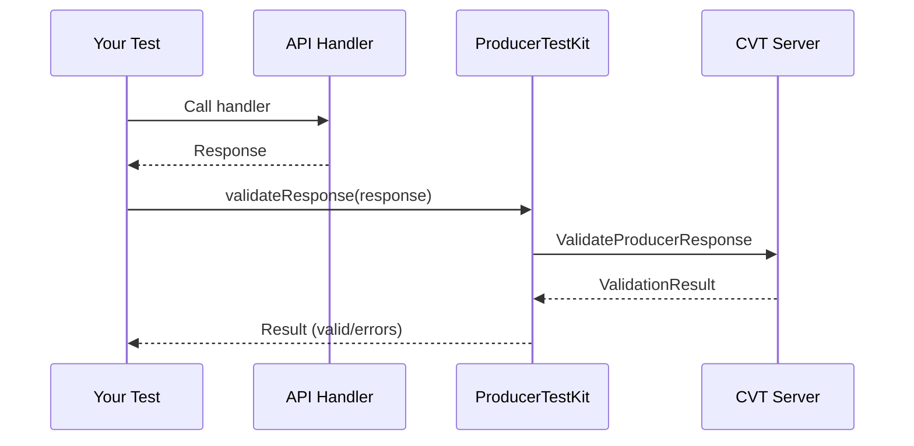

import Tabs from "@theme/Tabs";
import TabItem from "@theme/TabItem";

# Producer Testing Guide

Producer testing answers: **"Does my API actually return what my spec promises?"** This is Bob's side of the handshake — the consumer side is in [Consumer Testing](./consumer-testing.mdx). If you're new to CVT, read the [Introduction](../intro.md) first.

As the producer you own the OpenAPI spec; your CI should register it with the shared CVT server so consumers can validate against it and [`can-i-deploy`](./can-i-deploy.mdx) can gate your releases.

## Approaches at a glance

| Approach | How it works | Runs where | Speed | Best for |
|---|---|---|---|---|
| **Schema compliance tests** | Unit-test handlers against the spec using `ProducerTestKit` | Your test suite | Fast | Fast feedback during dev; CI |
| **Middleware** (strict/warn/shadow) | CVT middleware validates real requests + responses in your running API | Your API server | Per-request overhead | Runtime enforcement; production rollout |
| **HTTP integration** | End-to-end HTTP calls into your running API, validated by CVT | Integration test suite | Medium | Routing / serialization bugs |

Most teams use all three: compliance tests in unit-test CI, middleware in staging+prod, HTTP integration in a pre-deploy job.

---

## Schema compliance testing

Call your handler, validate its response against the spec. No running HTTP server, no middleware — just the handler and CVT.

<Tabs groupId="sdk-language">
<TabItem value="nodejs" label="Node.js" default>

```typescript
import { ProducerTestKit } from "@sahina/cvt-sdk/producer";

describe("Pets API", () => {
  let testKit: ProducerTestKit;

  beforeAll(async () => {
    testKit = new ProducerTestKit({
      schemaId: "petstore",
      serverAddress: "localhost:9550",
    });
  });

  afterAll(async () => testKit.close());

  it("GET /pet/{petId} returns a valid response", async () => {
    const response = await petHandler.getPet("123");

    const result = await testKit.validateResponse({
      method: "GET",
      path: "/pet/123",
      response: { statusCode: 200, body: response },
    });

    expect(result.valid).toBe(true);
  });

  it("detects missing required fields", async () => {
    const result = await testKit.validateResponse({
      method: "GET",
      path: "/pet/123",
      response: { statusCode: 200, body: { id: 123 } }, // no name, no photoUrls
    });

    expect(result.valid).toBe(false);
    expect(result.errors[0]).toContain("name");
  });
});
```

</TabItem>
<TabItem value="python" label="Python">

```python
import pytest
from cvt_sdk.producer import ProducerTestKit, ProducerTestConfig

@pytest.fixture
def test_kit():
    kit = ProducerTestKit(ProducerTestConfig(
        schema_id="petstore",
        server_address="localhost:9550",
    ))
    yield kit
    kit.close()

def test_get_pet_returns_valid_response(test_kit, pet_handler):
    response = pet_handler.get_pet("123")

    result = test_kit.validate_response(
        method="GET", path="/pet/123",
        status_code=200, body=response,
    )
    assert result.valid

def test_detects_missing_required_fields(test_kit):
    result = test_kit.validate_response(
        method="GET", path="/pet/123",
        status_code=200, body={"id": 123},
    )
    assert not result.valid
    assert "name" in result.errors[0]
```

</TabItem>
<TabItem value="go" label="Go">

```go
func TestPetHandler(t *testing.T) {
    testKit, _ := producer.NewProducerTestKit(producer.TestConfig{
        SchemaID:      "petstore",
        ServerAddress: "localhost:9550",
    })
    defer testKit.Close()

    t.Run("GET /pet/{petId} returns valid response", func(t *testing.T) {
        resp := petHandler.GetPet(ctx, "123")

        result, _ := testKit.ValidateResponse(ctx, producer.ValidateResponseParams{
            Method: "GET", Path: "/pet/123",
            Response: producer.TestResponseData{StatusCode: 200, Body: resp},
        })
        assert.True(t, result.Valid)
    })

    t.Run("detects missing required fields", func(t *testing.T) {
        result, _ := testKit.ValidateResponse(ctx, producer.ValidateResponseParams{
            Method: "GET", Path: "/pet/123",
            Response: producer.TestResponseData{
                StatusCode: 200,
                Body:       map[string]any{"id": 123},
            },
        })
        assert.False(t, result.Valid)
    })
}
```

</TabItem>
<TabItem value="java" label="Java">

```java
public class PetHandlerTest {
    private ProducerTestKit testKit;

    @BeforeEach
    void setup() {
        testKit = ProducerTestKit.builder()
            .schemaId("petstore")
            .serverAddress("localhost:9550")
            .build();
    }

    @AfterEach
    void teardown() { testKit.close(); }

    @Test
    void getPetReturnsValidResponse() {
        var response = petHandler.getPet("123");

        var result = testKit.validateResponse("GET", "/pet/123",
            TestResponseData.builder().statusCode(200).body(response).build());

        assertTrue(result.isValid());
    }

    @Test
    void detectsMissingRequiredFields() {
        var result = testKit.validateResponse("GET", "/pet/123",
            TestResponseData.builder()
                .statusCode(200).body(Map.of("id", 123))
                .build());

        assertFalse(result.isValid());
        assertTrue(result.getErrors().get(0).contains("name"));
    }
}
```

</TabItem>
</Tabs>

<details>
<summary>How schema compliance testing works under the hood</summary>



TestKit talks to the CVT server over gRPC; CVT validates the response body, headers, and status code against the registered schema; errors come back as a list of specific violations.

</details>

<details>
<summary>Testing all response codes (200, 4xx, 5xx), not just the happy path</summary>

Error responses have their own schemas. Validate them too:

```typescript
it("validates 404 response", async () => {
  const result = await testKit.validateResponse({
    method: "GET",
    path: "/pet/nonexistent",
    response: { statusCode: 404, body: {} },
  });
  expect(result.valid).toBe(true);
});

it("validates 400 response for bad request", async () => {
  const result = await testKit.validateResponse({
    method: "POST",
    path: "/pet",
    response: { statusCode: 400, body: {} },
  });
  expect(result.valid).toBe(true);
});
```

Same pattern in Python / Go / Java with the respective `validateResponse` signatures.

</details>

---

## Middleware: runtime validation in your running API

Add CVT middleware to your HTTP server — every request and response is validated against the schema in real time. Middleware has three [validation modes](./validation-modes.mdx): `shadow` (metrics only), `warn` (log), `strict` (reject). Roll out shadow → warn → strict.

<Tabs groupId="sdk-language">
<TabItem value="nodejs" label="Node.js" default>

```typescript
import { createExpressMiddleware } from "@sahina/cvt-sdk/producer";

app.use(
  createExpressMiddleware({
    schemaId: "petstore",
    validator,
    mode: "strict", // or "warn" or "shadow"
  }),
);
```

</TabItem>
<TabItem value="python" label="Python">

```python
from cvt_sdk.producer import ProducerConfig, ValidationMode
from cvt_sdk.producer.adapters import ASGIMiddleware

config = ProducerConfig(
    schema_id="petstore",
    validator=validator,
    mode=ValidationMode.STRICT,
)
app.add_middleware(ASGIMiddleware, config=config)
```

</TabItem>
<TabItem value="go" label="Go">

```go
config := producer.Config{
    SchemaID:  "petstore",
    Validator: validator,
    Mode:      producer.ModeStrict,
}
http.Handle("/", adapters.NetHTTPMiddleware(config)(myHandler))
```

</TabItem>
<TabItem value="java" label="Java">

```java
// Spring
registry.addInterceptor(new SpringInterceptor(config))
    .addPathPatterns("/api/**");
```

</TabItem>
</Tabs>

For the three modes and the recommended rollout, see **[Validation Modes](./validation-modes.mdx)**.

<details>
<summary>Other framework adapters (Fastify, Gin, Flask, FastAPI, Spring…)</summary>

<Tabs groupId="producer-framework">
<TabItem value="fastify" label="Fastify">

```typescript
import { fastifyProducerPlugin } from "@sahina/cvt-sdk/producer";
fastify.register(fastifyProducerPlugin, { schemaId: "petstore", validator });
```

</TabItem>
<TabItem value="gin" label="Gin">

```go
router := gin.Default()
router.Use(adapters.GinMiddleware(config))
```

</TabItem>
<TabItem value="fastapi" label="FastAPI">

```python
from cvt_sdk.producer.adapters import ASGIMiddleware
app.add_middleware(ASGIMiddleware, config=config)
```

</TabItem>
<TabItem value="flask" label="Flask">

```python
from cvt_sdk.producer.adapters import WSGIMiddleware
app.wsgi_app = WSGIMiddleware(app.wsgi_app, config=config)
```

</TabItem>
</Tabs>

</details>

<details>
<summary>Excluding health checks and metrics paths from validation</summary>

```typescript
createExpressMiddleware({
  schemaId: "petstore",
  validator,
  mode: "strict",
  excludePaths: ["/health", "/metrics", "/ready"],
  includePaths: ["/api/**"],
});
```

Python / Go / Java configs have matching `excludePaths` / `includePaths` fields.

</details>

---

## Fixture generation

Generate request/response examples directly from the schema — useful for documentation, golden tests, or bootstrapping new consumer services.

```bash
cvt generate --schema ./openapi.json --list                            # list all endpoints
cvt generate --schema ./openapi.json --method GET --path /pet/{petId}  # generate one
cvt generate --schema ./openapi.json --method POST --path /pet --output-type request
```

SDK equivalents exist for all languages; see [CLI Reference](../reference/cli.mdx#generate) for flags and [API Reference](../reference/api.mdx) for the SDK surface.

---

## Schema registration in CI/CD

You (the producer) register your schema — consumers read it, they don't write it. Wire this into your CI so the registered schema always matches what's deployed:

<Tabs groupId="sdk-language">
<TabItem value="cli" label="CLI" default>

```bash
cvt register-schema my-api ./openapi.json \
  --version "$API_VERSION" \
  --server "$CVT_SERVER_URL" \
  --check-compatibility \
  --fail-on-breaking
```

</TabItem>
<TabItem value="nodejs" label="Node.js">

```typescript
const validator = new ContractValidator(process.env.CVT_SERVER_URL);
await validator.registerSchemaWithVersion(
  "my-api", "./openapi.json", process.env.API_VERSION
);
```

</TabItem>
<TabItem value="go" label="Go">

```go
validator, _ := cvt.NewValidator(os.Getenv("CVT_SERVER_URL"))
validator.RegisterSchemaWithVersion(ctx, "my-api", "./openapi.json", os.Getenv("API_VERSION"))
```

</TabItem>
</Tabs>

Full pipeline examples (including `can-i-deploy` as a deploy gate): **[CI/CD Integration Guide](./ci-cd-integration.mdx)**.

<details>
<summary>Why the producer owns schema registration</summary>

| If the producer registers… | If a consumer registers… |
|---|---|
| Schema always matches the real API | Schema may be stale or wrong |
| Single source of truth | Multiple consumers may register different versions |
| `can-i-deploy` is meaningful | Breaking-change detection is unreliable |
| Clear ownership | Unclear who maintains the contract |

Consumers registering for **local development** is fine — it's what the Quick Start does. In CI, the producer's pipeline should be the only writer.

</details>

---

## Deployment safety with `can-i-deploy`

Before shipping a schema change, run [`can-i-deploy`](./can-i-deploy.mdx) to check whether any registered consumer would break. That page covers the full workflow — CI wiring, verdict interpretation, environment promotion. Summary:

```bash
cvt can-i-deploy --schema petstore --version $NEW_VERSION --env prod
# Exit 0 = safe; exit 1 = blocked with affected-consumer details
```

---

## Related

- **[Consumer Testing](./consumer-testing.mdx)** — the other side of the handshake.
- **[CanIDeploy](./can-i-deploy.mdx)** — pre-deploy safety gate.
- **[Validation Modes](./validation-modes.mdx)** — strict / warn / shadow for middleware rollout.
- **[Breaking Changes Guide](./breaking-changes.mdx)** — what counts as breaking.
- **[CI/CD Integration Guide](./ci-cd-integration.mdx)** — GitHub Actions, GitLab, Jenkins.
- **[API Reference](../reference/api.mdx)** / **[CLI Reference](../reference/cli.mdx)**.

<details>
<summary>Best practices</summary>

1. **Test all response scenarios, not just 200** — schema compliance for 4xx/5xx responses catches error-handler regressions. Example above.
2. **Gate every prod deploy on `can-i-deploy`** — `cvt can-i-deploy --schema petstore --version $NEW_VERSION --env prod || exit 1`.
3. **Check each environment before promoting** — run `can-i-deploy` per `--env`.
4. **Roll out middleware gradually** — `shadow` → `warn` → `strict`, days or weeks apart, watching metrics at each step.

</details>

<details>
<summary>Troubleshooting</summary>

**"Schema not found"** — register it first: `await validator.registerSchema("petstore", "./openapi.json")`. In production, the producer's CI should handle this.

**"Path not found"** — your test path must match the OpenAPI template with concrete values: `/pet/123`, not `/pet/{petId}`.

**"No consumers registered" warning in `can-i-deploy`** — safe, expected if you're the first deploy or no consumers use `registerConsumer` yet. See [CanIDeploy troubleshooting](./can-i-deploy.mdx#no-consumers-registered).

</details>
