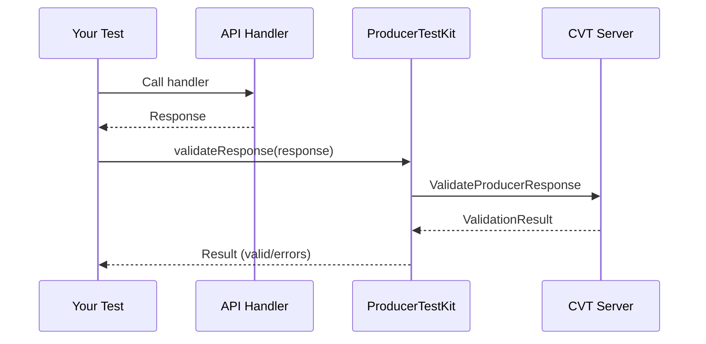
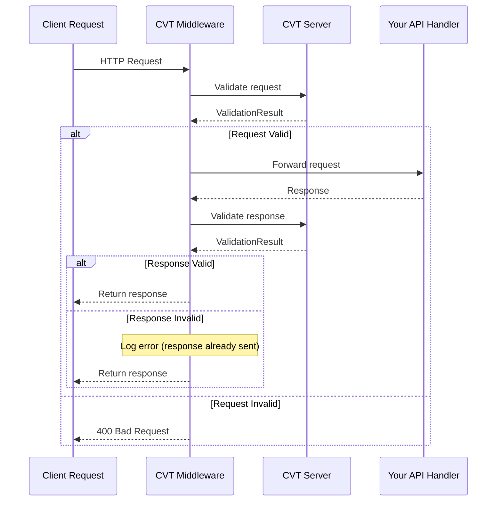

import Tabs from "@theme/Tabs";
import TabItem from "@theme/TabItem";

# Producer Testing Guide

This guide covers how to use CVT for producer-side contract testing. Producer testing ensures your API implementation matches your OpenAPI specification before deployment.

:::tip Example Schema
The examples in this guide use the Petstore schema from `sdks/shared/openapi.json`. Copy it to your project as `openapi.json` or adjust the paths to reference it directly.

All `registerSchema` methods accept both **file paths** and **URLs**:
```typescript
// From file
await validator.registerSchema("petstore", "./openapi.json");
// From URL
await validator.registerSchema("petstore", "https://petstore3.swagger.io/api/v3/openapi.json");
```
:::

## Overview

Producer testing answers the question: **"Does my API match my spec?"**

| Approach             | Who Uses It   | What It Tests                    |
| -------------------- | ------------- | -------------------------------- |
| **Consumer Testing** | API consumers | "Can I call this API correctly?" |
| **Producer Testing** | API producers | "Does my API match my spec?"     |

```text
┌─────────────────────┐     HTTP      ┌─────────────────────┐
│   Client Requests   │ ────────────► │   Your API Server   │
└─────────────────────┘               │   + CVT Middleware  │
                                      └─────────────────────┘
                                               │
                                               │ Validate
                                               ▼
                                      ┌─────────────────────┐
                                      │    CVT Server       │
                                      │    + Your Schema    │
                                      └─────────────────────┘
```

---

## Capabilities

| Capability                    | Server Required? | What It Answers                                    |
| ----------------------------- | ---------------- | -------------------------------------------------- |
| **Schema compliance tests**   | Yes              | "Does my handler return spec-compliant responses?" |
| **Breaking change detection** | No (CLI)         | "What changed between v1 and v2 of my spec?"       |
| **Consumer registry**         | Yes              | "Which services depend on my API?"                 |
| **can-i-deploy**              | Yes              | "Will this change break real consumers?"           |

---

## Validation Approaches

| Test Type             | Services Required | Speed  | Purpose                           |
| --------------------- | ----------------- | ------ | --------------------------------- |
| **Schema Compliance** | CVT only          | Fast   | Unit test handlers against schema |
| **Middleware Modes**  | CVT only          | Fast   | Test Strict/Warn/Shadow behavior  |
| **Consumer Registry** | CVT only          | Fast   | can-i-deploy checks               |
| **HTTP Integration**  | Producer + CVT    | Medium | Full end-to-end validation        |

- **Schema Compliance**: Test handlers directly without running a server. Fast feedback during development.
- **Middleware Modes**: CVT middleware validates requests/responses in real-time. Three modes for different stages.
- **Consumer Registry**: Track which endpoints consumers use. Enables `can-i-deploy` safety checks.
- **HTTP Integration**: Real HTTP calls to running API. Tests complete stack including routing/serialization.

---

## Schema Compliance Testing

Schema compliance testing validates that your API handlers return responses matching your OpenAPI specification.

### How It Works



1. Register your OpenAPI schema with CVT server
2. Call your handler with test data
3. Validate the response against the schema
4. Get detailed error messages for any mismatches

### Basic Example

<Tabs groupId="sdk-language">
<TabItem value="nodejs" label="Node.js">

```typescript
import { ProducerTestKit } from "@sahina/cvt-sdk/producer";

describe("Petstore API", () => {
  let testKit: ProducerTestKit;

  beforeAll(async () => {
    testKit = new ProducerTestKit({
      schemaId: "petstore",
      serverAddress: "localhost:9550",
    });
  });

  afterAll(async () => {
    testKit.close();
  });

  it("GET /pet/{petId} returns valid response", async () => {
    // Call your actual handler
    const response = await petHandler.getPet("123");

    // Validate against schema
    const result = await testKit.validateResponse({
      method: "GET",
      path: "/pet/123",
      response: {
        statusCode: 200,
        body: response,
      },
    });

    expect(result.valid).toBe(true);
    expect(result.errors).toHaveLength(0);
  });

  it("detects missing required fields", async () => {
    const result = await testKit.validateResponse({
      method: "GET",
      path: "/pet/123",
      response: {
        statusCode: 200,
        body: { id: 123 }, // missing 'name' and 'photoUrls' fields
      },
    });

    expect(result.valid).toBe(false);
    expect(result.errors[0]).toContain("name");
  });
});
```

</TabItem>
<TabItem value="python" label="Python">

```python
import pytest
from cvt_sdk.producer import ProducerTestKit, ProducerTestConfig

@pytest.fixture
def test_kit():
    kit = ProducerTestKit(ProducerTestConfig(
        schema_id="petstore",
        server_address="localhost:9550",
    ))
    yield kit
    kit.close()

def test_get_pet_returns_valid_response(test_kit, pet_handler):
    # Call your handler
    response = pet_handler.get_pet("123")

    # Validate
    result = test_kit.validate_response(
        method="GET",
        path="/pet/123",
        status_code=200,
        body=response,
    )

    assert result.valid
    assert len(result.errors) == 0

def test_detects_missing_required_fields(test_kit):
    result = test_kit.validate_response(
        method="GET",
        path="/pet/123",
        status_code=200,
        body={"id": 123},  # missing 'name' and 'photoUrls' fields
    )

    assert not result.valid
    assert "name" in result.errors[0]
```

</TabItem>
<TabItem value="go" label="Go">

```go
func TestPetHandler(t *testing.T) {
    testKit, err := producer.NewProducerTestKit(producer.TestConfig{
        SchemaID:      "petstore",
        ServerAddress: "localhost:9550",
    })
    require.NoError(t, err)
    defer func() { _ = testKit.Close() }()

    t.Run("GET /pet/{petId} returns valid response", func(t *testing.T) {
        // Call your handler
        resp := petHandler.GetPet(ctx, "123")

        // Validate
        result, err := testKit.ValidateResponse(ctx, producer.ValidateResponseParams{
            Method: "GET",
            Path:   "/pet/123",
            Response: producer.TestResponseData{
                StatusCode: 200,
                Body:       resp,
            },
        })

        require.NoError(t, err)
        assert.True(t, result.Valid)
    })

    t.Run("detects missing required fields", func(t *testing.T) {
        result, err := testKit.ValidateResponse(ctx, producer.ValidateResponseParams{
            Method: "GET",
            Path:   "/pet/123",
            Response: producer.TestResponseData{
                StatusCode: 200,
                Body:       map[string]any{"id": 123}, // missing 'name' and 'photoUrls' fields
            },
        })

        require.NoError(t, err)
        assert.False(t, result.Valid)
    })
}
```

</TabItem>
<TabItem value="java" label="Java">

```java
public class PetHandlerTest {
    private ProducerTestKit testKit;

    @BeforeEach
    void setup() {
        testKit = ProducerTestKit.builder()
            .schemaId("petstore")
            .serverAddress("localhost:9550")
            .build();
    }

    @AfterEach
    void teardown() {
        testKit.close();
    }

    @Test
    void getPetReturnsValidResponse() {
        // Call your handler
        var response = petHandler.getPet("123");

        // Validate
        var result = testKit.validateResponse(
            "GET",
            "/pet/123",
            TestResponseData.builder()
                .statusCode(200)
                .body(response)
                .build()
        );

        assertTrue(result.isValid());
        assertTrue(result.getErrors().isEmpty());
    }

    @Test
    void detectsMissingRequiredFields() {
        var result = testKit.validateResponse(
            "GET",
            "/pet/123",
            TestResponseData.builder()
                .statusCode(200)
                .body(Map.of("id", 123))  // missing 'name' and 'photoUrls' fields
                .build()
        );

        assertFalse(result.isValid());
        assertTrue(result.getErrors().get(0).contains("name"));
    }
}
```

</TabItem>
</Tabs>

---

## Producer Middleware

For runtime validation, add CVT middleware to your HTTP server.

### How Middleware Works



### Framework Examples

<Tabs groupId="producer-framework">
<TabItem value="express" label="Express">

```typescript
import { createExpressMiddleware } from "@sahina/cvt-sdk/producer";

app.use(
  createExpressMiddleware({
    schemaId: "petstore",
    validator,
    mode: "strict", // or 'warn' or 'shadow'
  }),
);
```

</TabItem>
<TabItem value="fastify" label="Fastify">

```typescript
import { fastifyProducerPlugin } from "@sahina/cvt-sdk/producer";

fastify.register(fastifyProducerPlugin, { schemaId: "petstore", validator });
```

</TabItem>
<TabItem value="go-http" label="Go net/http">

```go
import "github.com/sahina/cvt/sdks/go/cvt/producer/adapters"

config := producer.Config{
    SchemaID:  "petstore",
    Validator: validator,
    Mode:      producer.ModeStrict,
}
http.Handle("/", adapters.NetHTTPMiddleware(config)(myHandler))
```

</TabItem>
<TabItem value="gin" label="Gin">

```go
router := gin.Default()
router.Use(adapters.GinMiddleware(config))
```

</TabItem>
<TabItem value="fastapi" label="FastAPI">

```python
from cvt_sdk.producer import ProducerConfig, ValidationMode
from cvt_sdk.producer.adapters import ASGIMiddleware

config = ProducerConfig(
    schema_id="petstore",
    validator=validator,
    mode=ValidationMode.STRICT,
)
app.add_middleware(ASGIMiddleware, config=config)
```

</TabItem>
<TabItem value="flask" label="Flask">

```python
from cvt_sdk.producer.adapters import WSGIMiddleware

app.wsgi_app = WSGIMiddleware(app.wsgi_app, config=config)
```

</TabItem>
<TabItem value="spring" label="Spring">

```java
registry.addInterceptor(new SpringInterceptor(config))
    .addPathPatterns("/api/**");
```

</TabItem>
</Tabs>

### Path Filtering

Exclude health checks, metrics, or other paths from validation:

<Tabs groupId="sdk-language">
<TabItem value="nodejs" label="Node.js">

```typescript
createExpressMiddleware({
  schemaId: "petstore",
  validator,
  mode: "strict",
  excludePaths: ["/health", "/metrics", "/ready"],
  includePaths: ["/api/**"],
});
```

</TabItem>
<TabItem value="python" label="Python">

```python
config = ProducerConfig(
    schema_id="petstore",
    validator=validator,
    mode=ValidationMode.STRICT,
    exclude_paths=["/health", "/metrics", "/ready"],
    include_paths=["/api/**"],
)
```

</TabItem>
<TabItem value="go" label="Go">

```go
config := producer.Config{
    SchemaID:     "petstore",
    Validator:    validator,
    Mode:         producer.ModeStrict,
    ExcludePaths: []string{"/health", "/metrics", "/ready"},
    IncludePaths: []string{"/api/**"},
}
```

</TabItem>
<TabItem value="java" label="Java">

```java
ProducerConfig config = ProducerConfig.builder()
    .schemaId("petstore")
    .validator(validator)
    .mode(ValidationMode.STRICT)
    .excludePaths(List.of("/health", "/metrics", "/ready"))
    .includePaths(List.of("/api/**"))
    .build();
```

</TabItem>
</Tabs>

---

## Validation Modes

See [Validation Modes](./validation-modes.mdx) for detailed information.

| Mode       | Request Violation | Response Violation | Use Case               |
| ---------- | ----------------- | ------------------ | ---------------------- |
| **strict** | Reject with 400   | Log error          | Production enforcement |
| **warn**   | Log, continue     | Log, continue      | Gradual rollout        |
| **shadow** | Silent            | Silent             | Initial deployment     |

### Recommended Rollout

```text
Deploy with SHADOW → Analyze metrics → Switch to WARN → Fix issues → Switch to STRICT
```

---

## Consumer Registry

Track which services depend on your API.

### Listing Your Consumers

<Tabs groupId="sdk-language">
<TabItem value="nodejs" label="Node.js">

```typescript
const consumers = await validator.listConsumers("petstore", "prod");

console.log(`${consumers.length} services depend on petstore in prod`);
for (const consumer of consumers) {
  console.log(`- ${consumer.consumerId} v${consumer.consumerVersion}`);
}
```

</TabItem>
<TabItem value="python" label="Python">

```python
consumers = validator.list_consumers("petstore", "prod")

print(f"{len(consumers)} services depend on petstore in prod")
for consumer in consumers:
    print(f"- {consumer.consumer_id} v{consumer.consumer_version}")
```

</TabItem>
<TabItem value="go" label="Go">

```go
consumers, err := validator.ListConsumers(ctx, "petstore", "prod")
if err != nil {
    log.Fatal(err)
}

fmt.Printf("%d services depend on petstore in prod\n", len(consumers))
for _, consumer := range consumers {
    fmt.Printf("- %s v%s\n", consumer.ConsumerID, consumer.ConsumerVersion)
}
```

</TabItem>
<TabItem value="java" label="Java">

```java
List<ConsumerInfo> consumers = validator.listConsumers("petstore", "prod");

System.out.printf("%d services depend on petstore in prod%n", consumers.size());
for (ConsumerInfo consumer : consumers) {
    System.out.printf("- %s v%s%n", consumer.getConsumerId(), consumer.getConsumerVersion());
}
```

</TabItem>
</Tabs>

### Understanding Consumer Registrations

Consumers register after their contract tests pass:

```typescript
// A consumer (not you) registers like this:
await validator.registerConsumer({
  consumerId: "order-service",
  consumerVersion: "2.1.0",
  schemaId: "petstore", // Your API
  schemaVersion: "1.0.0",
  environment: "prod",
  usedEndpoints: [
    {
      method: "GET",
      path: "/pet/{petId}",
      usedFields: ["id", "name", "status"],
    },
  ],
});
```

This tells you:

- `order-service` depends on your API
- They use `GET /pet/{petId}`
- They specifically need the `id`, `name`, and `status` fields

---

## Deployment Safety (can-i-deploy)

Before deploying a new schema version, check if it will break any consumers.

### CLI Usage

```bash
# Check if v2.0.0 can be deployed to production
cvt can-i-deploy --schema petstore --version 2.0.0 --env prod

# JSON output for CI/CD
cvt can-i-deploy --schema petstore --version 2.0.0 --env prod --json
```

### SDK Usage

<Tabs groupId="sdk-language">
<TabItem value="nodejs" label="Node.js">

```typescript
const result = await validator.canIDeploy("petstore", "2.0.0", "prod");

if (!result.safeToDeploy) {
  console.error("Cannot deploy:", result.summary);
  for (const consumer of result.affectedConsumers) {
    if (consumer.willBreak) {
      console.error(`- ${consumer.consumerId} will break`);
    }
  }
  process.exit(1);
}
```

</TabItem>
<TabItem value="python" label="Python">

```python
result = validator.can_i_deploy("petstore", "2.0.0", "prod")

if not result.safe_to_deploy:
    print(f"Cannot deploy: {result.summary}")
    for consumer in result.affected_consumers:
        if consumer.will_break:
            print(f"- {consumer.consumer_id} will break")
    sys.exit(1)
```

</TabItem>
<TabItem value="go" label="Go">

```go
result, err := validator.CanIDeploy(ctx, "petstore", "2.0.0", "prod")
if err != nil {
    log.Fatal(err)
}

if !result.SafeToDeploy {
    fmt.Println("Cannot deploy:", result.Summary)
    for _, consumer := range result.AffectedConsumers {
        if consumer.WillBreak {
            fmt.Printf("- %s will break\n", consumer.ConsumerID)
        }
    }
    os.Exit(1)
}
```

</TabItem>
<TabItem value="java" label="Java">

```java
CanIDeployResult result = validator.canIDeploy("petstore", "2.0.0", "prod");

if (!result.isSafeToDeploy()) {
    System.err.println("Cannot deploy: " + result.getSummary());
    for (ConsumerImpact consumer : result.getAffectedConsumers()) {
        if (consumer.isWillBreak()) {
            System.err.printf("- %s will break%n", consumer.getConsumerId());
        }
    }
    System.exit(1);
}
```

</TabItem>
</Tabs>

### Breaking Change Types

The `can-i-deploy` command detects these breaking change types:

| Type                       | Description                                      |
| -------------------------- | ------------------------------------------------ |
| `ENDPOINT_REMOVED`         | An endpoint (method + path) was removed          |
| `REQUIRED_FIELD_ADDED`     | A required field was added to request body       |
| `TYPE_CHANGED`             | A field's type changed incompatibly              |
| `REQUIRED_PARAMETER_ADDED` | A required query/path/header parameter was added |
| `RESPONSE_SCHEMA_CHANGED`  | Response schema changed in a breaking way        |
| `ENUM_VALUE_REMOVED`       | An enum value was removed from a field           |

### Example Output (Unsafe)

```text
Deployment Safety Check
=======================
Schema:      petstore
Version:     2.0.0
Environment: prod

UNSAFE TO DEPLOY

Breaking changes in v2.0.0:
  - FIELD_REMOVED: GET /pet/{petId} response removed 'status'

Affected consumers in production:
  ├── order-service v2.1.0
  │   Schema version: 1.0.0
  │   Impact: BREAKING
  │   Affected by:
  │     - GET /pet/{petId}
  │
  └── inventory-service v1.0.0
      Schema version: 1.0.0
      Impact: None

Safe consumers:     1/2
Affected consumers: 1/2

Recommendation: Coordinate with order-service team before deploying.
```

---

## Test Fixture Generation

Generate test data from your OpenAPI schema for documentation and testing.

<Tabs groupId="sdk-language">
<TabItem value="nodejs" label="Node.js">

```typescript
// Generate complete request/response fixture
const fixture = await validator.generateFixture("GET", "/pet/{petId}");
console.log(fixture.request); // { method, path, headers, body }
console.log(fixture.response); // { statusCode, headers, body }

// Generate response only with schema examples
const response = await validator.generateResponse("GET", "/pet/{petId}", {
  statusCode: 200,
  useExamples: true,
});
```

</TabItem>
<TabItem value="python" label="Python">

```python
# Generate complete request/response fixture
fixture = validator.generate_fixture("GET", "/pet/{petId}")
print(fixture.request)   # { method, path, headers, body }
print(fixture.response)  # { status_code, headers, body }

# Generate response only with schema examples
response = validator.generate_response("GET", "/pet/{petId}",
    status_code=200,
    use_examples=True,
)
```

</TabItem>
<TabItem value="go" label="Go">

```go
// Generate complete request/response fixture
fixture, err := validator.GenerateFixture(ctx, "GET", "/pet/{petId}")
if err != nil {
    log.Fatal(err)
}
fmt.Println(fixture.Request)   // { Method, Path, Headers, Body }
fmt.Println(fixture.Response)  // { StatusCode, Headers, Body }

// Generate response only with schema examples
response, err := validator.GenerateResponse(ctx, "GET", "/pet/{petId}",
    cvt.GenerateResponseOptions{
        StatusCode:  200,
        UseExamples: true,
    },
)
```

</TabItem>
<TabItem value="java" label="Java">

```java
// Generate complete request/response fixture
Fixture fixture = validator.generateFixture("GET", "/pet/{petId}");
System.out.println(fixture.getRequest());   // { method, path, headers, body }
System.out.println(fixture.getResponse());  // { statusCode, headers, body }

// Generate response only with schema examples
ResponseFixture response = validator.generateResponse("GET", "/pet/{petId}",
    GenerateResponseOptions.builder()
        .statusCode(200)
        .useExamples(true)
        .build()
);
```

</TabItem>
</Tabs>

### CLI Usage

```bash
# List all endpoints in a schema
cvt generate --schema ./openapi.json --list

# Generate fixture for an endpoint
cvt generate --schema ./openapi.json --endpoint "GET /pet/{petId}"

# Generate request only
cvt generate --schema ./openapi.json --endpoint "POST /pet" --output-type request

# Use examples from schema
cvt generate --schema ./openapi.json --endpoint "GET /pet/{petId}" --use-examples
```

---

## CI/CD Integration

### GitHub Actions

```yaml
name: Deploy API

on:
  push:
    branches: [main]

jobs:
  test:
    runs-on: ubuntu-latest
    steps:
      - uses: actions/checkout@v4

      - name: Run contract tests
        run: npm test

      - name: Check deployment safety
        run: |
          cvt can-i-deploy \
            --schema ${{ env.SCHEMA_ID }} \
            --version ${{ env.VERSION }} \
            --env prod \
            --server ${{ secrets.CVT_SERVER }}

      - name: Deploy
        if: success()
        run: ./deploy.sh
```

### GitLab CI

```yaml
stages:
  - test
  - safety-check
  - deploy

contract-tests:
  stage: test
  script:
    - npm test

deployment-safety:
  stage: safety-check
  script:
    - cvt can-i-deploy --schema $SCHEMA_ID --version $VERSION --env prod --json
  allow_failure: false

deploy:
  stage: deploy
  script:
    - ./deploy.sh
  only:
    - main
```

---

## Best Practices

### 1. Test All Response Scenarios

Don't just test the happy path:

<Tabs groupId="sdk-language">
<TabItem value="nodejs" label="Node.js">

```typescript
it("validates 404 response", async () => {
  const result = await testKit.validateResponse({
    method: "GET",
    path: "/pet/nonexistent",
    response: {
      statusCode: 404,
      body: {},
    },
  });
  expect(result.valid).toBe(true);
});

it("validates 400 response for bad request", async () => {
  const result = await testKit.validateResponse({
    method: "POST",
    path: "/pet",
    response: {
      statusCode: 400,
      body: {},
    },
  });
  expect(result.valid).toBe(true);
});
```

</TabItem>
<TabItem value="python" label="Python">

```python
def test_validates_404_response(test_kit):
    result = test_kit.validate_response(
        method="GET",
        path="/pet/nonexistent",
        status_code=404,
        body={},
    )
    assert result.valid

def test_validates_400_response_for_bad_request(test_kit):
    result = test_kit.validate_response(
        method="POST",
        path="/pet",
        status_code=400,
        body={},
    )
    assert result.valid
```

</TabItem>
<TabItem value="go" label="Go">

```go
func TestValidates404Response(t *testing.T) {
    result, err := testKit.ValidateResponse(ctx, producer.ValidateResponseParams{
        Method: "GET",
        Path:   "/pet/nonexistent",
        Response: producer.TestResponseData{
            StatusCode: 404,
            Body:       map[string]any{},
        },
    })
    require.NoError(t, err)
    assert.True(t, result.Valid)
}

func TestValidates400ResponseForBadRequest(t *testing.T) {
    result, err := testKit.ValidateResponse(ctx, producer.ValidateResponseParams{
        Method: "POST",
        Path:   "/pet",
        Response: producer.TestResponseData{
            StatusCode: 400,
            Body:       map[string]any{},
        },
    })
    require.NoError(t, err)
    assert.True(t, result.Valid)
}
```

</TabItem>
<TabItem value="java" label="Java">

```java
@Test
void validates404Response() {
    var result = testKit.validateResponse(
        "GET",
        "/pet/nonexistent",
        TestResponseData.builder()
            .statusCode(404)
            .body(Map.of())
            .build()
    );
    assertTrue(result.isValid());
}

@Test
void validates400ResponseForBadRequest() {
    var result = testKit.validateResponse(
        "POST",
        "/pet",
        TestResponseData.builder()
            .statusCode(400)
            .body(Map.of())
            .build()
    );
    assertTrue(result.isValid());
}
```

</TabItem>
</Tabs>

### 2. Run can-i-deploy in CI

Make deployment safety checks a required gate:

```bash
cvt can-i-deploy --schema petstore --version $NEW_VERSION --env prod || exit 1
```

### 3. Use Environment-Specific Checks

Check each environment before promoting:

```bash
# Check staging first
cvt can-i-deploy --schema petstore --version 2.0.0 --env staging

# Then production
cvt can-i-deploy --schema petstore --version 2.0.0 --env prod
```

### 4. Gradual Middleware Rollout

Start with `shadow` mode, progress to `strict`:

```typescript
// Week 1: Shadow mode - metrics only
mode: "shadow";

// Week 2: Warn mode - log violations
mode: "warn";

// Week 3: Strict mode - full enforcement
mode: "strict";
```

---

## Troubleshooting

### "Schema not found" Error

Ensure the schema is registered before running producer tests:

<Tabs groupId="sdk-language">
<TabItem value="nodejs" label="Node.js">

```typescript
await validator.registerSchema({
  schemaId: "petstore",
  schemaVersion: "1.0.0",
  content: fs.readFileSync("./openapi.json", "utf-8"),
});
```

</TabItem>
<TabItem value="python" label="Python">

```python
validator.register_schema(
    schema_id="petstore",
    schema_version="1.0.0",
    content=open("./openapi.json").read(),
)
```

</TabItem>
<TabItem value="go" label="Go">

```go
content, _ := os.ReadFile("./openapi.json")
err := validator.RegisterSchema(ctx, cvt.RegisterSchemaOptions{
    SchemaID:      "petstore",
    SchemaVersion: "1.0.0",
    Content:       string(content),
})
```

</TabItem>
<TabItem value="java" label="Java">

```java
String content = Files.readString(Path.of("./openapi.json"));
validator.registerSchema(RegisterSchemaOptions.builder()
    .schemaId("petstore")
    .schemaVersion("1.0.0")
    .content(content)
    .build());
```

</TabItem>
</Tabs>

### "Path not found" Error

Check that the path in your test matches the OpenAPI spec:

<Tabs groupId="sdk-language">
<TabItem value="nodejs" label="Node.js">

```typescript
// If spec has: /pet/{petId}
// Use actual path values:
path: '/pet/123',  // NOT '/pet/{petId}'
```

</TabItem>
<TabItem value="python" label="Python">

```python
# If spec has: /pet/{petId}
# Use actual path values:
path="/pet/123"  # NOT "/pet/{petId}"
```

</TabItem>
<TabItem value="go" label="Go">

```go
// If spec has: /pet/{petId}
// Use actual path values:
Path: "/pet/123",  // NOT "/pet/{petId}"
```

</TabItem>
<TabItem value="java" label="Java">

```java
// If spec has: /pet/{petId}
// Use actual path values:
"/pet/123"  // NOT "/pet/{petId}"
```

</TabItem>
</Tabs>

### "No consumers registered" Warning

This is normal if you're the first to deploy or if no consumers have registered:

```text
SAFE TO DEPLOY
No consumers registered for this schema in prod.
```

---

## Next Steps

- **[Consumer Testing Guide](./consumer-testing.mdx)** - Test your API integrations
- **[Validation Modes](./validation-modes.mdx)** - Configure validation behavior
- **[Breaking Changes Guide](./breaking-changes.mdx)** - Understand schema compatibility
- **[API Reference](../reference/api.mdx)** - Full API documentation
