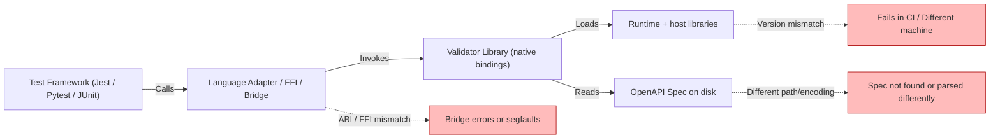
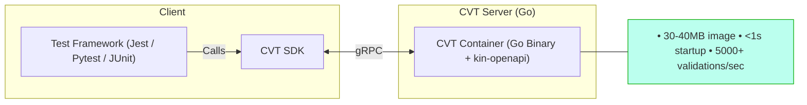
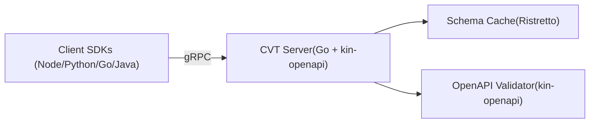
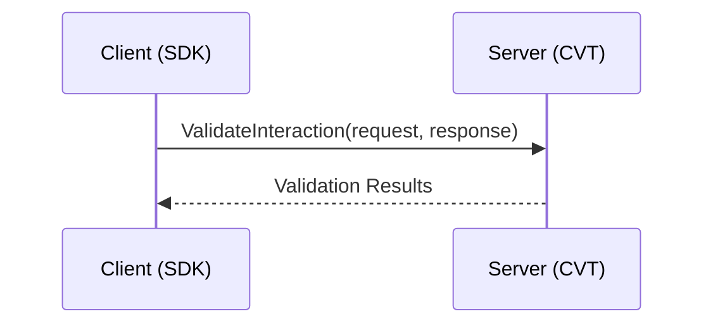
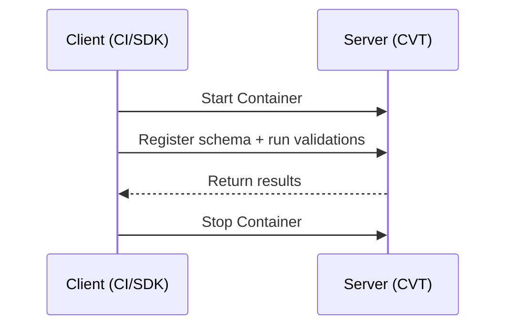
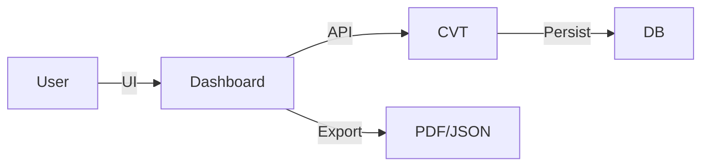
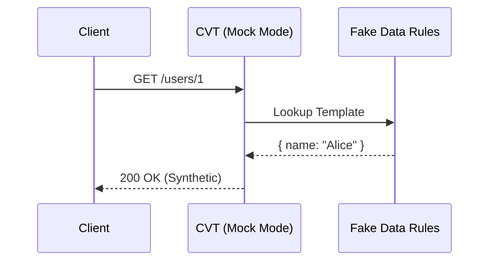
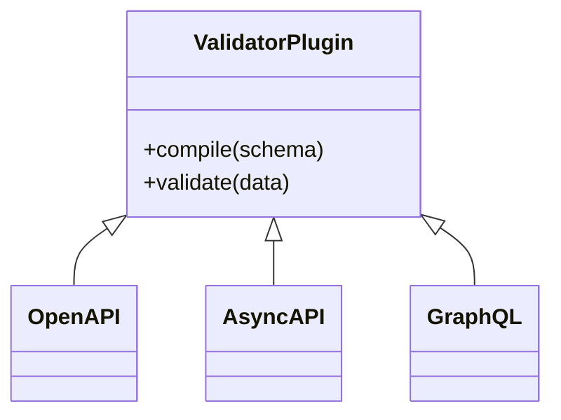

# Contract Validator Toolkit (CVT)

:::info Historical Document
This PRD captures the **original vision and requirements** that guided CVT development. Some implementation details may have evolved since this document was written. For current information, see:

- **[API Reference](../reference/api.mdx)** - Current gRPC service definition
- **[SDK Documentation](../reference/sdk/index.mdx)** - SDK installation and usage
- **[Configuration Reference](../reference/configuration.md)** - Environment variables
- **[Development Guide](../development/contributing.md)** - Building and testing
:::

## 1. Overview

This document defines the product, architectural, and implementation requirements for the **Contract Validator Toolkit (CVT)** — a consumer- and producer-based contract validation platform for OpenAPI v2 and v3 specifications. CVT is built using **Go**, exposes a **gRPC-first interface**, and runs entirely via **Docker**

## 2. Definitions

**Contract testing** validates API interactions against a published contract. It supports two primary modes:

| Term                                | Definition                                                                                                                                                          |
| ----------------------------------- | ------------------------------------------------------------------------------------------------------------------------------------------------------------------- |
| **Consumer-based Contract Testing** | Validation initiated by an API consumer to ensure that requests and responses conform to a published OpenAPI contract.                                              |
| **Producer-based Contract Testing** | Validation performed by an API provider to ensure their implementation conforms to the contract. |

### CVT supports both consumer and producer contract testing

## 3. Problem Statement

Developers and API consumers need a consistent, language-agnostic way to validate API requests and responses against OpenAPI contracts. In practice, teams often rely on embedding or wrapping existing validation libraries (for example, a mature Java-based contract validator) inside their test environment. Two common integration approaches create markedly different operational trade-offs:

- **Bridge / Host-bound approach**: Integrates a validator directly, leading to brittle runtime dependencies, host environment coupling, and "works on my machine" inconsistencies across dev, CI, and production.
- **Docker-sandboxed CVT approach**: Runs the validator in an isolated container via a gRPC interface, ensuring reproducible and consistent validation across all environments by encapsulating dependencies.
  The Contract Validator Toolkit (CVT) is a proposal for the Docker-sandboxed approach. CVT centralizes contract validation in a lightweight, containerized service that provides a consistent gRPC API. The following sections explain the operational differences with examples, and visualize the two deployment/runtime models.
  Key problems seen with bridge/host-bound integration:
- **Host dependency drift**: different runtime versions or local dependency versions cause validation logic to behave differently across machines.
- **Fragile bridging**: adapters and native bindings often fail silently or produce obscure errors when ABI or OS expectations differ.
- **CI inconsistency**: containers or runner images that lack required native libraries or runtime dependencies break tests unpredictably.
- **Security surface**: running third-party validators in-process increases attack surface and makes resource isolation difficult.
- **Version governance**: coordinating validator library upgrades across multiple repositories becomes a release engineering burden.
  How a Docker-based CVT solves these problems:
- **Encapsulation**: validator and its transitive dependencies are bundled into an immutable image.
- **Reproducibility**: identical behavior across developer laptops, CI runners, and centralized instances.
- **Isolation**: resource limits, user namespaces, and network restrictions protect the host.
- **Central governance**: a shared CVT instance can be managed, monitored, and upgraded independently from consumer codebases.

The subsections below visualize each approach and highlight where failures commonly occur.

### 3.1 Bridge / Host-bound Validator (Brittle)

This approach embeds a language-specific validator directly into the test environment, sharing the host's runtime and native libraries. This tight coupling often leads to brittle runtime dependencies and inconsistencies across different environments (e.g., "works on my machine" failures, CI flakiness).



### 3.2 Docker-based CVT (Recommended)

This approach encapsulates the validator and its dependencies within a container image, exposing it via a stable gRPC interface. Test runtime SDKs communicate with the container over the network, ensuring reproducible validation behavior across all environments (dev, CI, central) and simplifying upgrades.



## 4. Goals and Objectives

- **Focus on consumer- and producer-based contract testing** for OpenAPI v2 and v3.
- **SDKs are not test frameworks** — users continue to use existing testing libraries like Jest, Pytest, or JUnit.
- **SDKs handle communication and orchestration only**: gRPC protocol handling, configuration, authentication, and result retrieval.
- Maintain **uniform and simple SDK functionality** across Node, Python, Go, and Java.
- Deliver **Docker-only** deployments suitable for local, central, or CI use.
- **Lightweight and performant**: Go-based server for minimal resource usage and fast startup.

## 5. System Architecture Summary

The system follows a strict **Client-Server** architecture.

### Components

1. **Client** – The consumer-side SDKs and test runners (Node, Python, Go, Java). Handles gRPC protocol abstraction and test execution.
2. **Server** – The CVT Container (Go-based), handling validation logic with kin-openapi and in-memory schema caching.



### 5.1 Project Structure (Monorepo)

The project adopts a **Monorepo** structure to ensure strict synchronization between the API definitions (Protobuf/OpenAPI) and the implementation (Server + SDKs).

```shell
/
├── api/                        # SINGLE SOURCE OF TRUTH
│   ├── protos/                 # gRPC definitions (cvt.proto)
│   └── openapi/                # OpenAPI specs
├── server/                     # Go Server Implementation
│   ├── main.go                 # Server entry point
│   ├── validator_service.go    # Core validation service
│   ├── validation_utils.go     # Input validation
│   ├── cache.go                # Schema caching (Ristretto)
│   ├── health.go               # Health check service
│   ├── logger.go               # Structured logging (Zap)
│   ├── pb/                     # Generated protobuf code
│   ├── go.mod                  # Go dependencies
│   └── Dockerfile              # Multi-stage build
├── sdks/                       # Client Libraries
│   ├── java/
│   ├── node/
│   ├── python/
│   └── go/
└── tools/                      # Shared build/codegen scripts
```

## 6. Runtime and Execution Models

| Mode                     | Description                                                           | Persistence             |
| ------------------------ | --------------------------------------------------------------------- | ----------------------- |
| **Local Developer Mode** | Run CVT locally via Docker Compose for iterative contract validation. | File-based or SQLite    |
| **Centralized Mode**     | Shared internal instance for team-wide validation.                    | Postgres (Phase P1)     |
| **Ephemeral CI Mode**    | CVT runs temporarily in CI and terminates after tests.                | File-based or in-memory |

Run locally with:

```bash
docker compose up -d
```

## 7. Functional Requirements

### 7.1 Schema Registration

- Register OpenAPI v2/v3 schemas.
- Convert v2 → v3 at load time via swagger2openapi.
- Assign schema ID, hash, and version.

### 7.2 Validation Runs

- Submit request/response payloads for validation.
- Return structured results (pass/fail + error details).

### 7.3 SDK Behavior

The SDK provides a simple, high-level API to validate API interactions against the contract. It is designed to be used alongside any test framework (Jest, Mocha, Pytest, etc.).

**1. Instantiation**
Initialize the validator with a schema source (local file or remote ID).

```ts
const validator = new ContractValidator({
  schema: "./openapi.yaml", // Or a URL/ID for remote
});
```

**2. Validation**
The `validate` method takes two arguments: the **Request** (what was sent) and the **Response** (what was received).

```ts
const result = await validator.validate(
  // Request
  {
    method: "POST",
    path: "/users",
    body: { name: "Alice" },
  },
  // Response
  {
    statusCode: 201,
    body: { id: 1, name: "Alice" },
  },
);
```

**3. Assertion**
The result object is a simple boolean/error structure, making it compatible with **any assertion library**.

```ts
// Jest
expect(result.valid).toBe(true);

// Chai
assert.isTrue(result.valid);

// Native Node.js
assert.ok(result.valid, result.errors?.join(", "));
```

**4. Fluent API (Alternative)**
For developers who prefer a chained builder pattern, the SDK offers a fluent interface:

```ts
const result = await validator
  .interaction()
  .request({ method: "POST", path: "/users", body: { name: "Alice" } })
  .response({ statusCode: 201, body: { id: 1 } })
  .validate();
```

#### Python

```python
from cvt_sdk import ContractValidator

validator = ContractValidator(schema="./openapi.yaml")

result = validator.validate(
    request={"method": "POST", "path": "/users", "body": {"name": "Alice"}},
    response={"status_code": 201, "body": {"id": 1}}
)

assert result.valid, f"Contract failed: {result.errors}"
```

#### Java

```java
import com.cvt.ContractValidator;
import static org.junit.jupiter.api.Assertions.assertTrue;

ContractValidator validator = new ContractValidator(new Config().schema("./openapi.yaml"));

ValidationResult result = validator.validate(
    Request.builder().method("POST").path("/users").body("{\"name\": \"Alice\"}").build(),
    Response.builder().statusCode(201).body("{\"id\": 1}").build()
);

assertTrue(result.isValid(), "Contract violation: " + result.getErrors());
```

#### Go

```go
import (
    "testing"
    "github.com/cvt/cvt-sdk/go/cvt"
    "github.com/stretchr/testify/assert"
)

func TestContract(t *testing.T) {
    validator := cvt.NewValidator(cvt.Config{Schema: "./openapi.yaml"})

    result, _ := validator.Validate(
        cvt.Request{Method: "POST", Path: "/users", Body: map[string]any{"name": "Alice"}},
        cvt.Response{StatusCode: 201, Body: map[string]any{"id": 1}},
    )

    assert.True(t, result.Valid, "Contract violation: %v", result.Errors)
}
```

### 7.4 Compatibility Engine (P1)

- Compare schema versions and flag breaking/non-breaking changes.

## 8. Typical Use Cases and Flow

### 8.1 Local Developer Workflow



### 8.2 CI Pipeline Workflow



---

## 9. gRPC Service Definition (Pseudocode)

```proto
service ContractValidator {
  rpc RegisterSchema(RegisterSchemaRequest) returns (RegisterSchemaResponse);
  rpc ValidateInteraction(InteractionRequest) returns (ValidationResult);
}
message RegisterSchemaRequest {
  string schema_id = 1;        // Unique identifier
  string schema_content = 2;   // OpenAPI spec (YAML or JSON)
}
message RegisterSchemaResponse {
  bool success = 1;
  string message = 2;
}
message InteractionRequest {
  string schema_id = 1;
  RequestData request = 2;
  ResponseData response = 3;
}
message RequestData {
  string method = 1;                   // HTTP method
  string path = 2;                     // HTTP path
  map<string, string> headers = 3;     // HTTP headers
  string body = 4;                     // Request body (JSON)
}
message ResponseData {
  int32 status_code = 1;               // HTTP status code
  map<string, string> headers = 2;     // Response headers
  string body = 3;                     // Response body (JSON)
}
message ValidationResult {
  bool valid = 1;
  repeated string errors = 2;
}
```

> **Current Implementation**: gRPC-only. REST endpoints may be added in Phase P1 if needed.

## 10. Validation Engine Design

Core engine uses **Go** ecosystem libraries (specifically **kin-openapi**) for robust OpenAPI v2/v3 validation.

**Key Libraries:**

- **kin-openapi** (v0.133.0): OpenAPI 3.0/3.1 and Swagger 2.0 parsing and validation
- **Ristretto** (v0.2.0): High-performance schema caching (LRU, 1000 schemas max, 24h TTL)
- **Zap** (v1.27.1): Structured logging

**Core Implementation:**

```go
// ValidatorService implements the gRPC ContractValidator service
type ValidatorService struct {
    cache *SchemaCache // Ristretto cache for compiled validators
}

func (s *ValidatorService) RegisterSchema(ctx context.Context, req *pb.RegisterSchemaRequest) (*pb.RegisterSchemaResponse, error) {
    // Parse and validate OpenAPI schema
    loader := openapi3.NewLoader()
    doc, err := loader.LoadFromData([]byte(req.SchemaContent))
    if err != nil {
        return &pb.RegisterSchemaResponse{Success: false, Message: err.Error()}, nil
    }

    // Validate the OpenAPI document
    if err := doc.Validate(loader.Context); err != nil {
        return &pb.RegisterSchemaResponse{Success: false, Message: err.Error()}, nil
    }

    // Store in cache
    s.cache.Set(req.SchemaId, doc)
    return &pb.RegisterSchemaResponse{Success: true}, nil
}

func (s *ValidatorService) ValidateInteraction(ctx context.Context, req *pb.InteractionRequest) (*pb.ValidationResult, error) {
    // Retrieve compiled validator from cache
    doc, found := s.cache.Get(req.SchemaId)
    if !found {
        return &pb.ValidationResult{Valid: false, Errors: []string{"Schema not found"}}, nil
    }

    // Create router and find matching operation
    router, _ := legacy.NewRouter(doc)
    route, pathParams, err := router.FindRoute(httpReq)
    if err != nil {
        return &pb.ValidationResult{Valid: false, Errors: []string{err.Error()}}, nil
    }

    // Validate request and response
    if err := openapi3filter.ValidateRequest(ctx, requestInput); err != nil {
        return &pb.ValidationResult{Valid: false, Errors: []string{err.Error()}}, nil
    }
    if err := openapi3filter.ValidateResponse(ctx, responseInput); err != nil {
        return &pb.ValidationResult{Valid: false, Errors: []string{err.Error()}}, nil
    }

    return &pb.ValidationResult{Valid: true}, nil
}
```

**Architecture Benefits:**

- **Performance**: 5000+ validations/second, <1 second startup time
- **Memory Efficiency**: ~50-100MB base memory usage
- **Container Size**: ~30-40MB Docker image (vs ~200MB+ for Java)
- **Binary Distribution**: Single static binary (~19MB), no runtime dependencies

## 11. SDK Deliverables

| SDK     | Language   | Purpose                                 | Status      |
| ------- | ---------- | --------------------------------------- | ----------- |
| Node.js | TypeScript | Primary reference implementation (gRPC) | ✅ Complete |
| Python  | Python     | Pytest/unittest compatible (gRPC)       | 🚧 Stub     |
| Go      | Go         | Go test integration (gRPC)              | 🚧 Stub     |
| Java    | Java       | JUnit integration (gRPC)                | 🚧 Stub     |

> **Note**: Current implementation is gRPC-only. REST fallback may be added in future phases if needed.
>
> SDKs are **pure validator clients**. They do not execute HTTP requests; they only transport request/response data to the CVT container for validation.

## 12. Non-functional Requirements

| Category       | Requirement                                                        |
| -------------- | ------------------------------------------------------------------ |
| Performance    | 5000+ validations/sec, <1s startup time, <10ms schema registration |
| Reliability    | 99.9% uptime (central mode)                                        |
| Security       | JWT auth, HTTPS, sandboxed validator, non-root container           |
| Observability  | Structured logs (Zap), gRPC health checks, metrics                 |
| Compatibility  | OpenAPI v2 (Swagger) and v3.0/v3.1                                 |
| Resource Usage | ~50-100MB memory, ~30-40MB container image                         |

## 13. Deployment

- **Docker-only deployment** using Docker Compose
- Supports local development, centralized, and CI usage
  Example CI integration:

```yaml
steps:
  - name: Start CVT
    run: docker compose up -d
  - name: Run Contract Tests
    run: npm test
  - name: Stop CVT
    run: docker compose down
```

## 14. Phased Development Plan

### Initial Phase – MVP (Completed)

- ✅ Client-Server architecture
- ✅ All SDKs (Node, Python, Go, Java)
- ✅ Core Validation Logic with **kin-openapi**
- ✅ Docker and Docker Compose deployment
- ✅ **Go server implementation** (migrated from Java)

**Migration to Go (November 2025):**

- Replaced Java server with Go implementation for better performance and resource efficiency
- **Zero breaking changes**: 100% API compatibility maintained
- **Library**: Using **kin-openapi** for OpenAPI 2.0/3.0/3.1 validation
- **Benefits**: 5x smaller images, 3-5x faster startup, 5x less memory usage
- All existing SDKs work without modification

### Phase P1 – User Interface

- Admin UI / Dashboard for schema management and visualization
- Flexible persistence options: **file-based**, **SQLite**, or **Postgres**

### Phase P2 – Multi-component Scalability

- Scalability enhancements
- Multi-component architecture support

## 15. Risks and Mitigations

### 15.1 Key Risks

| Risk                        | Impact | Mitigation                                                                                                                                                                                   | Owner              |
| :-------------------------- | :----- | :------------------------------------------------------------------------------------------------------------------------------------------------------------------------------------------- | :----------------- |
| **OpenAPI v2 Quirks**       | High   | • Explicit conversion pipeline (lint → convert → validate)<br>• Surface warnings in SDK<br>• "Dry-run" conversion endpoint                                                                   | Schema Team        |
| **False Positives in Diff** | Medium | • Deterministic diff rules<br>• Machine-readable changelogs<br>• Human-in-the-loop review workflow                                                                                           | Compatibility Team |
| **Resource Constraints**    | Low    | • Go's efficient memory model (~50-100MB base)<br>• Small container images (~30-40MB)<br>• Fast startup times (<1s)<br>• Hardened runtime (non-root)                                         | Ops / Infra        |
| **Performance**             | Low    | • **Ristretto LRU cache** for compiled validators (1000 max, 24h TTL)<br>• Go's efficient concurrency (goroutines)<br>• **5000+ validations/sec** baseline<br>• Horizontal scaling if needed | Core Engine Team   |

### 15.2 Cross-cutting Risks

- **Security:** Scan uploads for malicious constructs (ReDoS, infinite recursion). Run unprivileged.
- **Governance:** Require ownership metadata. Audit logs for all changes.
- **Observability:** Return structured error codes. Store original & converted specs.
- **Compatibility:** Strict API versioning. Test matrix for gRPC & SDKs across languages.
- **Compliance:** Configurable retention policies. Encryption-at-rest.

### 15.3 Next Steps

- Implement conversion-preview endpoint.

- Define diff classification rules.
- Benchmark validation throughput.

#### Risk: Data retention and compliance for stored specs/results

- Mitigation:
  - Provide configurable retention policies for runs and specs, deletion/purge APIs, and encryption-at-rest for persisted stores.
- Owner: Platform / Compliance

### 15.3 High-priority next steps (actionable)

- Convert each short risk line into the expanded format above and assign owners in your project tracker.
- Implement conversion-preview and surface `conversionWarnings` in registration APIs.
- Define and publish diff classification rules and a curated test set for validating the compatibility engine.
- Create a benchmark plan for validation throughput and start collecting baseline metrics in a staging environment.

## 16. Future Enhancements

### 16.1 Admin Dashboard

**Goal:** GUI for schema management, run visualization, and reporting.
**Stack:** Next.js App Router + ShadCN.



### 16.2 Mocking & Simulation

**Goal:** Serve synthetic, schema-compliant responses for E2E testing without live backends. Supports **Faker.js** templates for realistic data.



### 16.3 Plugin Architecture

**Goal:** Support non-OpenAPI formats (AsyncAPI, GraphQL, Protobuf) via dynamic plugins.



### 16.4 Governance & Intelligence

- **Policy Engine:** Enforce rules (e.g., "No breaking changes") via YAML policies.

- **Federation:** Secure, encrypted schema sharing across teams with RBAC.
- **AI Assistant:** Auto-generate schemas, suggest fixes, and summarize changelogs.

## 17. Appendix

- [UX Study for Ephemeral Environments](https://app.mural.co/t/americanexpress8416/m/americanexpress8416/1760020485378/eb5b860f7ac20e87847365abef3cf2fe5889518c)
