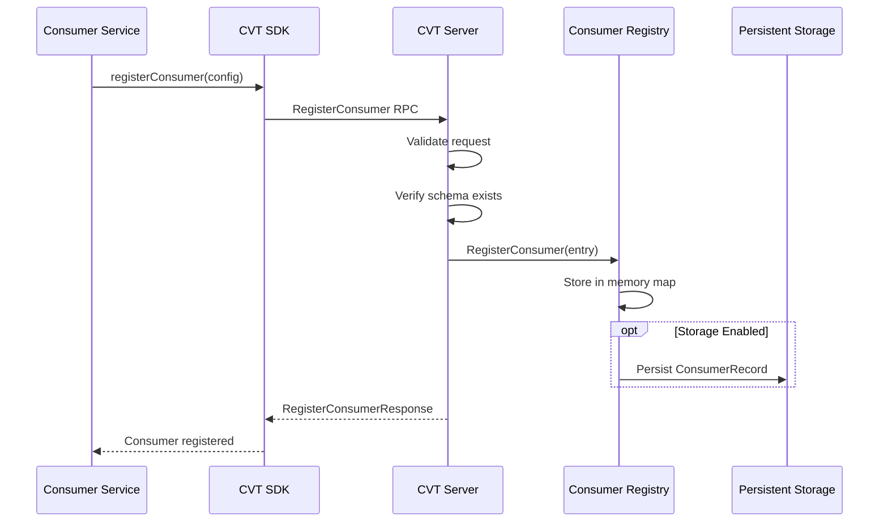
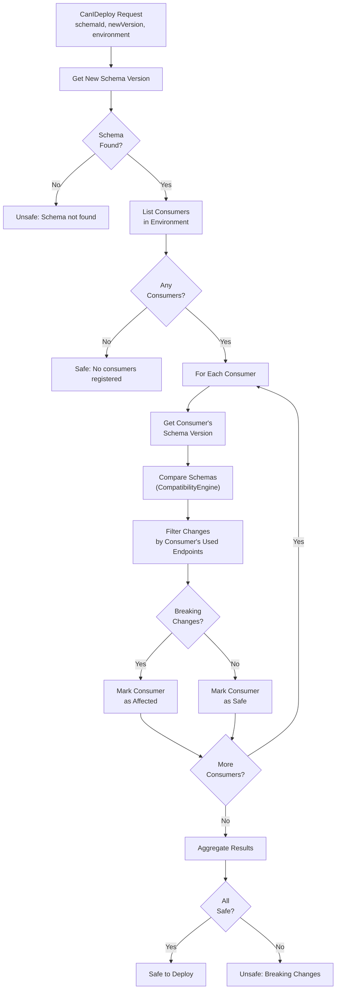

# Consumer Registry Architecture

This document provides a detailed look at CVT's consumer registry, deployment safety workflow, and breaking change detection.

## Overview

The consumer registry enables:

1. **Consumer tracking**: Record which consumers depend on which schemas
2. **Endpoint usage tracking**: Know exactly which endpoints/fields consumers use
3. **Breaking change detection**: Identify incompatible schema changes
4. **Deployment safety**: Prevent breaking changes from reaching production

## Consumer Registration Flow



## Consumer Registration

### Registration Request

Consumers register their dependencies with detailed usage information:

```typescript
await validator.registerConsumer({
  consumerId: "order-service",        // Your service name
  consumerVersion: "2.1.0",           // Your service version
  schemaId: "user-api",               // Schema you depend on
  schemaVersion: "1.0.0",             // Schema version you tested against
  environment: "prod",                // Target environment
  usedEndpoints: [
    {
      method: "GET",
      path: "/users/{id}",
      usedFields: ["id", "email", "name"]  // Fields you consume
    },
    {
      method: "POST",
      path: "/users",
      usedFields: ["id"]  // Only need ID from response
    }
  ]
});
```

### Consumer Data Model

```go
type ConsumerEntry struct {
    ConsumerID      string          // e.g., "order-service"
    ConsumerVersion string          // e.g., "2.1.0"
    SchemaID        string          // Schema dependency
    SchemaVersion   string          // Version tested against
    Environment     string          // dev, staging, prod
    RegisteredAt    time.Time
    LastValidatedAt time.Time
    UsedEndpoints   []EndpointUsage
}

type EndpointUsage struct {
    Method     string   // HTTP method
    Path       string   // API path template
    UsedFields []string // Response fields consumed
}
```

### Consumer Key Format

Consumers are uniquely identified by:

```text
{consumerID}/{schemaID}/{environment}

Examples:
  order-service/user-api/prod
  billing-service/user-api/prod
  order-service/user-api/staging
```

This allows the same consumer to register different dependencies per environment.

## Deployment Safety (CanIDeploy)

### Workflow



### CanIDeploy Request

```bash
# CLI usage
cvt can-i-deploy --schema user-api --version 2.0.0 --env prod
```

```typescript
// SDK usage
const result = await validator.canIDeploy("user-api", "2.0.0", "prod");

if (!result.safeToDeploy) {
  console.log("Breaking changes:", result.breakingChanges);
  console.log("Affected consumers:", result.affectedConsumers);
}
```

### CanIDeploy Response

```typescript
interface CanIDeployResponse {
  safeToDeploy: boolean;
  summary: string;
  breakingChanges: BreakingChange[];
  affectedConsumers: ConsumerImpact[];
}

interface ConsumerImpact {
  consumerId: string;
  consumerVersion: string;
  currentSchemaVersion: string;
  environment: string;
  willBreak: boolean;
  relevantChanges: BreakingChange[];
}
```

## Breaking Change Detection

### Compatibility Engine

CVT's CompatibilityEngine compares two schema versions and detects breaking changes:

```text
Old Schema (v1.0.0)          New Schema (v2.0.0)
       │                           │
       └───────────┬───────────────┘
                   │
                   ▼
         ┌─────────────────┐
         │ CompareSchemas  │
         └────────┬────────┘
                  │
    ┌─────────────┼─────────────┐
    │             │             │
    ▼             ▼             ▼
┌────────┐  ┌──────────┐  ┌──────────┐
│Endpoint│  │Parameter │  │Response  │
│Changes │  │ Changes  │  │ Changes  │
└────────┘  └──────────┘  └──────────┘
    │             │             │
    └─────────────┼─────────────┘
                  │
                  ▼
         []*BreakingChange
```

### Breaking Change Types

| Type | Description | Example |
|------|-------------|---------|
| `ENDPOINT_REMOVED` | Endpoint deleted from schema | `DELETE /users/{id}` removed |
| `REQUIRED_FIELD_ADDED` | New required field in request body | `email` now required in POST /users |
| `REQUIRED_PARAMETER_ADDED` | New required parameter | `?apiVersion` now required |
| `TYPE_CHANGED` | Property type changed | `id` changed from string to integer |
| `RESPONSE_SCHEMA_CHANGED` | Response structure changed | `email` removed from GET /users response |
| `ENUM_VALUE_REMOVED` | Enum option removed | `status` no longer accepts "pending" |

### Detection Logic

#### Endpoint Removed

```go
// For each path in old schema
for path, oldPathItem := range oldDoc.Paths.Map() {
    newPathItem := newDoc.Paths.Find(path)
    // Check each HTTP method
    if oldPathItem.Get != nil && (newPathItem == nil || newPathItem.Get == nil) {
        // GET endpoint was removed
        changes = append(changes, &BreakingChange{
            Type: ENDPOINT_REMOVED,
            Path: path,
            Method: "GET",
        })
    }
}
```

#### Required Field Added

```go
// Get old required fields
oldRequired := getRequiredFields(oldBody)

// Check new required fields
for _, field := range newSchema.Required {
    if !oldRequired[field] {
        // New required field
        changes = append(changes, &BreakingChange{
            Type: REQUIRED_FIELD_ADDED,
            Path: path,
            Method: method,
            Description: fmt.Sprintf("Required field '%s' was added", field),
        })
    }
}
```

#### Type Changed

```go
// Check if type change is breaking
if oldType != newType && !isCompatibleTypeChange(oldType, newType) {
    changes = append(changes, &BreakingChange{
        Type: TYPE_CHANGED,
        Path: path,
        OldValue: oldType,
        NewValue: newType,
    })
}

// Some type changes are safe (widening)
func isCompatibleTypeChange(old, new string) bool {
    compatibleChanges := map[string][]string{
        "integer": {"number"},
        "int32":   {"int64", "integer", "number"},
        "int64":   {"number"},
        "float":   {"double", "number"},
    }
    return contains(compatibleChanges[old], new)
}
```

### Consumer Impact Analysis

Breaking changes are filtered by what each consumer actually uses:

```text
Breaking Changes:
  1. ENDPOINT_REMOVED: DELETE /users/{id}
  2. RESPONSE_SCHEMA_CHANGED: GET /users/{id} removed 'phone'
  3. REQUIRED_FIELD_ADDED: POST /users requires 'phone'

Consumer: order-service
  Used Endpoints:
    - GET /users/{id} [id, email, name]
    - POST /users [id]

Filtering Logic:
  1. DELETE /users/{id} - Not used by consumer → Skip
  2. GET /users/{id} 'phone' - Consumer doesn't use 'phone' → Skip
  3. POST /users 'phone' - Consumer uses this endpoint → BREAKING

Result: 1 breaking change affects order-service
```

```go
func filterChangesForConsumer(changes []*BreakingChange, endpoints []EndpointUsage) []*BreakingChange {
    var relevant []*BreakingChange

    for _, change := range changes {
        for _, ep := range endpoints {
            // Match by path and method
            pathMatches := change.Path == ep.Path || change.Path == ""
            methodMatches := change.Method == "" || change.Method == ep.Method

            if pathMatches && methodMatches {
                relevant = append(relevant, change)
                break
            }
        }
    }

    return relevant
}
```

## Consumer Registry Operations

### List Consumers

Query consumers by schema and environment:

```typescript
// List all prod consumers of user-api
const consumers = await validator.listConsumers("user-api", "prod");

// Returns
[
  {
    consumerId: "order-service",
    consumerVersion: "2.1.0",
    schemaVersion: "1.0.0",
    environment: "prod",
    usedEndpoints: [...]
  },
  {
    consumerId: "billing-service",
    consumerVersion: "1.0.0",
    schemaVersion: "1.0.0",
    environment: "prod",
    usedEndpoints: [...]
  }
]
```

### Deregister Consumer

Remove a consumer registration:

```typescript
await validator.deregisterConsumer({
  consumerId: "order-service",
  schemaId: "user-api",
  environment: "prod"
});
```

### Update Consumer Validation Time

Consumers can update their last validation timestamp:

```go
// Called after successful contract test run
storage.UpdateConsumerValidation(
    ctx,
    "order-service",
    "user-api",
    "prod",
    time.Now(),
)
```

## CI/CD Integration

### Typical Workflow

```text
┌─────────────────────────────────────────────────────────────┐
│                    Consumer Service CI                       │
├─────────────────────────────────────────────────────────────┤
│                                                              │
│  1. Run Contract Tests                                       │
│     ┌─────────────────────────────────────────────────────┐ │
│     │ npm test (with CVT validation)                      │ │
│     │   - Validate all API calls                          │ │
│     │   - Record which endpoints used                     │ │
│     └─────────────────────────────────────────────────────┘ │
│                          │                                   │
│                          ▼                                   │
│  2. Register Consumer (via SDK or gRPC RegisterConsumer)     │
│     ┌─────────────────────────────────────────────────────┐ │
│     │ await client.registerConsumer({                     │ │
│     │   consumerId: 'order-service',                      │ │
│     │   schemaId: 'user-api',                             │ │
│     │   consumerVersion: '1.0.0',                         │ │
│     │   environment: 'prod',                              │ │
│     │   endpoints: [{ method: 'GET', path: '/users/{id}' }│ │
│     │ });                                                 │ │
│     └─────────────────────────────────────────────────────┘ │
│                                                              │
└─────────────────────────────────────────────────────────────┘

┌─────────────────────────────────────────────────────────────┐
│                    Producer Service CI                       │
├─────────────────────────────────────────────────────────────┤
│                                                              │
│  1. Schema Validation                                        │
│     ┌─────────────────────────────────────────────────────┐ │
│     │ cvt validate --schema ./openapi.yaml                │ │
│     └─────────────────────────────────────────────────────┘ │
│                          │                                   │
│                          ▼                                   │
│  2. Can I Deploy?                                            │
│     ┌─────────────────────────────────────────────────────┐ │
│     │ cvt can-i-deploy                                    │ │
│     │   --schema user-api                                 │ │
│     │   --version 2.0.0                                   │ │
│     │   --env prod                                        │ │
│     │                                                     │ │
│     │ If unsafe: FAIL BUILD                               │ │
│     └─────────────────────────────────────────────────────┘ │
│                          │                                   │
│                          ▼                                   │
│  3. Deploy (if safe)                                         │
│                                                              │
└─────────────────────────────────────────────────────────────┘
```

### GitHub Actions Example

```yaml
# Consumer workflow
name: Contract Tests

on: [push, pull_request]

jobs:
  test:
    runs-on: ubuntu-latest
    services:
      cvt:
        image: ghcr.io/sahina/cvt:latest
        ports:
          - 9550:9550

    steps:
      - uses: actions/checkout@v4

      - name: Run Contract Tests
        run: npm test

      - name: Register Consumer
        if: github.ref == 'refs/heads/main'
        run: npm run register-consumer
        env:
          CVT_CONSUMER_ID: ${{ github.repository }}
          CVT_CONSUMER_VERSION: ${{ github.sha }}
          CVT_SCHEMA_ID: user-api
          CVT_ENV: prod
```

```yaml
# Producer workflow
name: Deploy

on:
  push:
    branches: [main]

jobs:
  deploy:
    runs-on: ubuntu-latest

    steps:
      - uses: actions/checkout@v4

      - name: Check Deployment Safety
        run: |
          cvt can-i-deploy \
            --schema user-api \
            --version $(cat openapi.yaml | yq .info.version) \
            --env prod
        # Fails if breaking changes would affect consumers
```

## Implementation Notes

Key implementation files:

| File | Purpose |
|------|---------|
| `server/cvtservice/validator_service.go` | RegisterConsumer, ListConsumers, CanIDeploy RPCs |
| `server/cvtservice/cache.go` | Consumer registry in-memory storage |
| `server/cvtservice/compatibility_engine.go` | Breaking change detection |
| `server/storage/storage.go` | ConsumerRecord interface |

## In Roadmap

The following consumer registry features are planned but not yet implemented:

- **Field-level impact analysis**: More granular detection of which fields affect consumers
- **Notification webhooks**: Alert consumer teams when breaking changes are proposed
- **Consumer groups**: Group consumers for batch notifications
- **Deprecation tracking**: Mark endpoints as deprecated and track consumer migration

---

## Related Documentation

- **[Architecture Overview](./index.md)** - System architecture
- **[Validation Engine](./validation-engine.md)** - Validation flow
- **[CLI Reference](../cli.mdx)** - can-i-deploy command documentation
