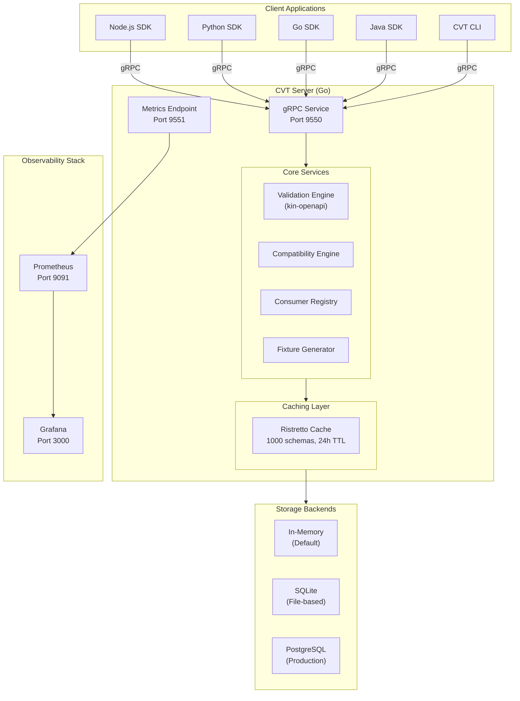

# Architecture Overview

This document provides a comprehensive overview of CVT's system architecture, components, and design decisions.

## Introduction

CVT (Contract Validator Toolkit) is a contract validation platform for OpenAPI v2/v3 specifications. It consists of:

- **CVT Server**: A Go-based gRPC server that validates HTTP request/response interactions against registered OpenAPI schemas
- **Client SDKs**: Native libraries for Node.js, Python, Go, and Java that communicate with the server
- **Storage Backends**: Pluggable persistence layer supporting in-memory, SQLite, and PostgreSQL
- **Observability Stack**: Prometheus metrics and Grafana dashboards for monitoring

## System Overview



## Core Components

### CVT Server

The server is implemented in Go and provides the following capabilities:

| Component | Technology | Purpose |
|-----------|------------|---------|
| gRPC Service | grpc-go | RPC interface for all client operations |
| Validation Engine | kin-openapi | OpenAPI parsing and request/response validation |
| Router | gorillamux | Route matching for OpenAPI paths |
| Cache | Ristretto | High-performance LRU cache for schemas |
| Logging | Zap | Structured logging |
| Metrics | Prometheus | Observability metrics |

**Key characteristics:**
- Single static binary (~23MB)
- Container image ~30-40MB (Alpine-based)
- Memory footprint: 50-100MB typical
- Startup time: <1 second

### Client SDKs

All SDKs provide a consistent interface for contract validation:

| SDK | Language | Features |
|-----|----------|----------|
| Node.js | TypeScript | Dynamic proto loading, Axios/Fetch adapters |
| Python | Python 3.12+ | requests/httpx adapters, uv package manager |
| Go | Go 1.25+ | http.RoundTripper adapter |
| Java | Java 21+ | Gradle build, Spring/Servlet middleware |

SDKs are **pure validator clients** - they handle gRPC communication, configuration, and authentication but do not execute HTTP requests themselves.

### Storage Backends

CVT supports three storage backends:

| Backend | Use Case | Persistence | Performance |
|---------|----------|-------------|-------------|
| In-Memory | Development, CI | None | Fastest |
| SQLite | Single-instance | File-based | Fast |
| PostgreSQL | Production | External DB | Scalable |

:::tip Storage Architecture
For detailed information about the storage layer, caching strategies, and data models, see [Storage Layer Architecture](./storage-layer.md).
:::

### Observability Stack

CVT integrates with Prometheus and Grafana for monitoring:

- **Metrics Endpoint**: Exposes Prometheus metrics on port 9551
- **Prometheus**: Scrapes metrics every 10 seconds
- **Grafana**: Pre-configured dashboards for validation performance

:::info Observability Details
For complete metrics reference, alert configuration, and dashboard setup, see the [Observability Guide](../../operations/observability.md).
:::

## gRPC Service Contract

The CVT server exposes the following gRPC services, organized by functional phase:

### Phase 1: Schema & Validation

| Service | Input | Output | Purpose |
|---------|-------|--------|---------|
| `RegisterSchema` | Schema ID, content, version | Success status, metadata | Register OpenAPI schema |
| `ValidateInteraction` | Schema ID, request, response | Validation result | Validate HTTP interaction |
| `GetSchema` | Schema ID, version | Schema content, metadata | Retrieve registered schema |
| `ListSchemas` | Filters, pagination | Schema list | List all schemas |
| `CompareSchemas` | Schema ID, old/new versions | Breaking changes | Detect breaking changes |
| `GenerateFixture` | Schema ID, endpoint | Request/response fixture | Generate test data |
| `ListEndpoints` | Schema ID | Endpoint list | List schema endpoints |
| `ValidateProducerResponse` | Schema ID, method, path, response | Validation result | Producer-side validation |

### Phase 2: Consumer Registry

| Service | Input | Output | Purpose |
|---------|-------|--------|---------|
| `RegisterConsumer` | Consumer ID, schema ID, endpoints | Consumer info | Register consumer dependency |
| `ListConsumers` | Schema ID, environment | Consumer list | List schema consumers |
| `DeregisterConsumer` | Consumer ID, schema ID | Success status | Remove consumer registration |

### Phase 3: Deployment Safety

| Service | Input | Output | Purpose |
|---------|-------|--------|---------|
| `CanIDeploy` | Schema ID, new version, environment | Safety assessment | Check deployment safety |

:::tip Validation Engine
For detailed information about how validation works, including the kin-openapi integration and route matching, see [Validation Engine Architecture](./validation-engine.md).
:::

## Deployment Models

CVT supports multiple deployment models to fit different use cases:

### Local Development

```text
┌─────────────────────────────────────────────────────────────┐
│                    Developer Machine                         │
├─────────────────────────────────────────────────────────────┤
│                                                              │
│   ┌──────────────┐    gRPC     ┌──────────────────────────┐ │
│   │  Test Suite  │ ──────────► │   CVT Server (Docker)    │ │
│   │  (Jest/etc)  │             │   Port 9550              │ │
│   └──────────────┘             └──────────────────────────┘ │
│                                                              │
└─────────────────────────────────────────────────────────────┘
```

**Characteristics:**
- Run via `make up` or `docker compose up`
- In-memory or SQLite storage
- Full observability stack optional

### CI/CD Pipeline

```text
┌─────────────────────────────────────────────────────────────┐
│                     CI Runner                                │
├─────────────────────────────────────────────────────────────┤
│                                                              │
│   1. Start Container    ┌────────────────────┐              │
│      ─────────────────► │   CVT Server       │              │
│                         │   (ephemeral)      │              │
│   2. Run Tests          │                    │              │
│      ─────────────────► │                    │              │
│                         │                    │              │
│   3. Stop Container     │                    │              │
│      ─────────────────► └────────────────────┘              │
│                                                              │
└─────────────────────────────────────────────────────────────┘
```

**Characteristics:**
- Ephemeral container lifecycle
- In-memory storage (no persistence needed)
- Fast startup for pipeline efficiency

### Centralized Production

```text
┌─────────────────────────────────────────────────────────────┐
│                    Production Environment                    │
├─────────────────────────────────────────────────────────────┤
│                                                              │
│   ┌──────────────┐                 ┌─────────────────────┐  │
│   │  Service A   │ ───┐            │    CVT Server       │  │
│   └──────────────┘    │            │    (persistent)     │  │
│                       │   gRPC     │         │           │  │
│   ┌──────────────┐    ├──────────► │         ▼           │  │
│   │  Service B   │ ───┤            │   ┌───────────┐     │  │
│   └──────────────┘    │            │   │ PostgreSQL│     │  │
│                       │            │   └───────────┘     │  │
│   ┌──────────────┐    │            │                     │  │
│   │  Service C   │ ───┘            │   Prometheus/       │  │
│   └──────────────┘                 │   Grafana           │  │
│                                    └─────────────────────┘  │
│                                                              │
└─────────────────────────────────────────────────────────────┘
```

**Characteristics:**
- PostgreSQL for persistent storage
- Consumer registry for deployment safety
- Full observability with alerting
- TLS/mTLS for secure communication

## Performance Architecture

CVT is designed for high-throughput validation with low latency.

### Performance Targets

| Metric | Target | Achieved By |
|--------|--------|-------------|
| Throughput | 5000+ validations/sec | Go concurrency, efficient caching |
| Startup time | <1 second | Single static binary |
| Memory | 50-100MB | Ristretto cache with bounded size |
| Container size | 30-40MB | Alpine base, multi-stage build |

### Caching Strategy

The caching layer is critical for performance:

```text
┌──────────────────────────────────────────────────────────────┐
│                      Request Flow                             │
├──────────────────────────────────────────────────────────────┤
│                                                               │
│   ValidateInteraction                                         │
│         │                                                     │
│         ▼                                                     │
│   ┌───────────┐    Hit     ┌──────────────────────────────┐  │
│   │   Cache   │ ─────────► │ Return cached SchemaEntry    │  │
│   │  Lookup   │            │ (Document + Metadata)        │  │
│   └───────────┘            └──────────────────────────────┘  │
│         │                                                     │
│         │ Miss                                                │
│         ▼                                                     │
│   ┌───────────┐            ┌──────────────────────────────┐  │
│   │  Storage  │ ─────────► │ Load from backend,           │  │
│   │   Read    │            │ populate cache, return       │  │
│   └───────────┘            └──────────────────────────────┘  │
│                                                               │
└──────────────────────────────────────────────────────────────┘
```

**Cache configuration:**
- Maximum schemas: 1000
- TTL: 24 hours
- Eviction policy: LRU with TinyLFU admission

### Concurrency Model

Go's goroutine-based concurrency allows CVT to handle many concurrent requests efficiently:

- Each gRPC request is handled in its own goroutine
- Schema cache is thread-safe (Ristretto handles concurrency)
- Consumer registry uses mutex protection for writes
- No global locks in the hot path

:::tip Storage Deep Dive
For detailed information about the caching implementation and storage backends, see [Storage Layer Architecture](./storage-layer.md).
:::

## Security Architecture

CVT provides multiple layers of security:

### Transport Security

| Feature | Configuration | Purpose |
|---------|--------------|---------|
| TLS | `CVT_TLS_ENABLED=true` | Encrypt all communication |
| mTLS | `CVT_TLS_CLIENT_AUTH=require` | Mutual authentication |

### Authentication

| Method | Configuration | Purpose |
|--------|--------------|---------|
| API Keys | `CVT_API_KEY_ENABLED=true` | Client authentication |
| Key File | `CVT_API_KEYS_FILE` | Externalized key management |

### Container Security

- Non-root user in Docker image
- Read-only filesystem support
- No shell in production image
- Resource limits configurable

## Deep Dive Documents

For detailed information about specific subsystems:

| Document | Topics Covered |
|----------|---------------|
| [Validation Engine](./validation-engine.md) | kin-openapi integration, route matching, request/response validation |
| [Storage Layer](./storage-layer.md) | Caching, persistence backends, data models |
| [Consumer Registry](./consumer-registry.md) | Consumer tracking, deployment safety, breaking change detection |
| [SDK Architecture](./sdk-architecture.md) | SDK design patterns, adapters, cross-language consistency |

---

## Related Documentation

- **[Configuration Reference](../configuration.md)** - Environment variables and settings
- **[API Reference](../api.mdx)** - Complete gRPC API documentation
- **[Observability Guide](../../operations/observability.md)** - Metrics and monitoring
- **[Development Guide](../../development/contributing.md)** - Building and testing
