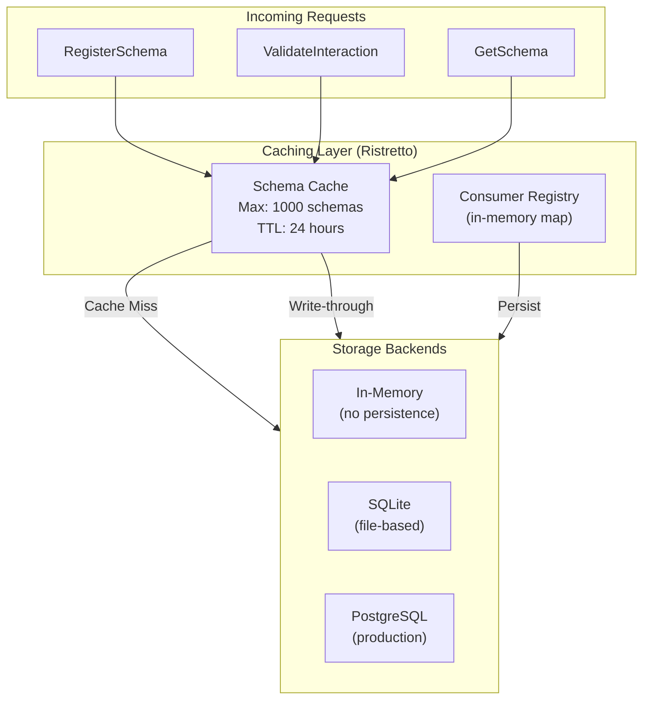

# Storage Layer Architecture

This document provides a detailed look at CVT's storage layer, including the caching strategy, persistence backends, and data models.

## Overview

CVT's storage layer provides:

1. **In-memory caching**: Fast access to schemas via Ristretto cache
2. **Pluggable persistence**: Support for SQLite and PostgreSQL
3. **Consumer registry storage**: Track consumer dependencies
4. **Validation records**: Optional storage of validation history

## Architecture



## Caching Layer

### Ristretto Cache

CVT uses [Ristretto](https://github.com/dgraph-io/ristretto) for high-performance caching.

**Why Ristretto:**

- TinyLFU admission policy for optimal hit rates
- Concurrent access without locks
- Memory-bounded with configurable limits
- TTL support for automatic expiration

### Cache Configuration

```go
const (
    MaxSchemas       = 1000           // Maximum cached schemas
    SchemaTTL        = 24 * time.Hour // Time-to-live
    CacheNumCounters = 10000          // 10x max items for accuracy
    CacheMaxCost     = 1000           // Each schema costs 1
    CacheBufferItems = 64             // Concurrent access buffer
)
```

### Cache Key Format

```text
Schema Keys:
  "my-api"           → Latest version of "my-api"
  "my-api@1.0.0"     → Specific version 1.0.0

Consumer Keys (in-memory map):
  "order-service/user-api/prod" → ConsumerEntry
```

### Cache Operations

#### Set (Write-through)

```text
RegisterSchema Request
        │
        ▼
┌───────────────────┐
│ Parse & Validate  │
│ OpenAPI Schema    │
└─────────┬─────────┘
          │
          ▼
┌───────────────────┐
│ Create            │
│ SchemaEntry       │
│ (doc + metadata)  │
└─────────┬─────────┘
          │
          ├──────────────────────────────────┐
          │                                  │
          ▼                                 ▼
┌───────────────────┐              ┌───────────────────┐
│ Cache.Set()       │              │ Storage.Set()     │
│ with TTL          │              │ (if enabled)      │
└───────────────────┘              └───────────────────┘
          │
          ▼
┌───────────────────┐
│ Cache.Wait()      │
│ (ensure available)│
└───────────────────┘
```

#### Get (Cache-first)

```text
ValidateInteraction Request
        │
        ▼
┌───────────────────┐
│ Cache.Get()       │
└─────────┬─────────┘
          │
    ┌─────┴─────┐
    │           │
   Hit         Miss
    │           │
    ▼          ▼
  Return    ┌───────────────┐
  Entry     │ Storage.Get() │
            │ (if enabled)  │
            └───────┬───────┘
                    │
              ┌─────┴─────┐
              │           │
            Found      Not Found
              │           │
              ▼          ▼
        ┌─────────┐    Return
        │ Populate│    Error
        │ Cache   │
        └─────────┘
              │
              ▼
           Return
           Entry
```

### Cache Metrics

CVT exposes cache metrics via Prometheus:

| Metric                   | Type    | Description          |
| ------------------------ | ------- | -------------------- |
| `cvt_cache_hits_total`   | Counter | Total cache hits     |
| `cvt_cache_misses_total` | Counter | Total cache misses   |
| `cvt_cache_items_total`  | Gauge   | Current cached items |
| `cvt_cache_size_bytes`   | Gauge   | Current cache size   |

**Target cache hit rate:** >80% in production

## Data Models

### SchemaEntry

Cached schema with metadata:

```go
type SchemaEntry struct {
    Document *openapi3.T      // Parsed OpenAPI document
    Content  string           // Raw schema content (JSON)
    Metadata *pb.SchemaMetadata
}

type SchemaMetadata struct {
    SchemaId       string
    SchemaVersion  string
    SchemaHash     string     // SHA256 of content
    OpenApiVersion string     // "3.0.0", "3.1.0"
    EndpointCount  int32
    RegisteredAt   int64      // Unix timestamp
    Ownership      *SchemaOwnership
}
```

### SchemaRecord (Persistent Storage)

Database schema record:

```go
type SchemaRecord struct {
    ID             string              // Internal UUID
    SchemaID       string              // User-facing identifier
    Version        string              // Semantic version
    Content        string              // Raw OpenAPI content
    ContentHash    string              // SHA256 hash
    Document       *openapi3.T         // Transient (not stored)
    OpenAPIVersion string              // Detected version
    EndpointCount  int32
    IsLatest       bool
    RegisteredAt   time.Time
    UpdatedAt      time.Time
    Ownership      *pb.SchemaOwnership
    Environment    string
}
```

### ConsumerEntry

Consumer registration:

```go
type ConsumerEntry struct {
    ConsumerID      string          // e.g., "order-service"
    ConsumerVersion string          // e.g., "2.1.0"
    SchemaID        string          // Schema dependency
    SchemaVersion   string          // Schema version used
    Environment     string          // dev, staging, prod
    RegisteredAt    time.Time
    LastValidatedAt time.Time
    UsedEndpoints   []EndpointUsage
}

type EndpointUsage struct {
    Method     string   // GET, POST, etc.
    Path       string   // /users/{id}
    UsedFields []string // Fields consumed from response
}
```

### ConsumerRecord (Persistent Storage)

Database consumer record:

```go
type ConsumerRecord struct {
    ID              string
    ConsumerID      string
    ConsumerVersion string
    SchemaID        string
    SchemaVersion   string
    Environment     string
    RegisteredAt    time.Time
    LastValidatedAt time.Time
    UsedEndpoints   []EndpointUsage
}
```

### ValidationRecord (Optional)

Stored validation runs (when persistence enabled):

```go
type ValidationRecord struct {
    ID              string
    SchemaID        string
    SchemaVersion   string
    SchemaHash      string
    RequestMethod   string
    RequestPath     string
    RequestHeaders  map[string]string
    RequestBody     string
    ResponseStatus  int32
    ResponseHeaders map[string]string
    ResponseBody    string
    Valid           bool
    Errors          []string
    DurationMs      int64
    ValidatedAt     time.Time
    Environment     string
    ClientID        string
    ClientIP        string
}
```

## Storage Backends

### Storage Interface

All backends implement this interface:

```go
type Store interface {
    // Schema operations
    SetSchema(ctx context.Context, record *SchemaRecord) error
    GetSchema(ctx context.Context, schemaID string) (*SchemaRecord, error)
    GetSchemaVersion(ctx context.Context, schemaID, version string) (*SchemaRecord, error)
    DeleteSchema(ctx context.Context, schemaID string) error
    ListSchemas(ctx context.Context, filter ListSchemasFilter) ([]*SchemaRecord, string, int32, error)

    // Consumer operations
    RegisterConsumer(ctx context.Context, record *ConsumerRecord) error
    GetConsumer(ctx context.Context, consumerID, schemaID, env string) (*ConsumerRecord, error)
    ListConsumers(ctx context.Context, filter ListConsumersFilter) ([]*ConsumerRecord, error)
    DeregisterConsumer(ctx context.Context, consumerID, schemaID, env string) error

    // Validation records (optional)
    RecordValidation(ctx context.Context, record *ValidationRecord) error
    ListValidations(ctx context.Context, filter ListValidationsFilter) ([]*ValidationRecord, string, error)

    // Lifecycle
    Migrate(ctx context.Context) error
    Close() error
    Ping(ctx context.Context) error
}
```

### In-Memory Backend

**Use case:** Development, testing, CI pipelines

**Characteristics:**

- No persistence (data lost on restart)
- Fastest performance
- No external dependencies
- Default when `CVT_STORAGE_ENABLED=false`

### SQLite Backend

**Use case:** Single-instance deployments, local development with persistence

**Characteristics:**

- File-based persistence
- Single-writer limitation
- No external dependencies
- Good for development with data preservation

**Configuration:**

```bash
CVT_STORAGE_ENABLED=true
CVT_STORAGE_TYPE=sqlite
CVT_STORAGE_DSN=./cvt.db
```

**Schema migrations:** Automatic on startup

### PostgreSQL Backend

**Use case:** Production deployments, multi-instance setups

**Characteristics:**

- Full ACID compliance
- Concurrent access support
- Connection pooling
- Scalable for high volume

**Configuration:**

```bash
CVT_STORAGE_ENABLED=true
CVT_STORAGE_TYPE=postgres
CVT_POSTGRES_HOST=db.example.com
CVT_POSTGRES_PORT=5432
CVT_POSTGRES_USER=cvt
CVT_POSTGRES_PASSWORD=secret
CVT_POSTGRES_DB=cvt
CVT_POSTGRES_SSLMODE=require
CVT_POSTGRES_MAX_CONNS=25
```

**Schema migrations:** Automatic on startup using embedded SQL

### Database Schema (PostgreSQL)

```sql
-- Schemas table
CREATE TABLE schemas (
    id UUID PRIMARY KEY,
    schema_id VARCHAR(255) NOT NULL,
    version VARCHAR(50) NOT NULL,
    content TEXT NOT NULL,
    content_hash VARCHAR(64) NOT NULL,
    openapi_version VARCHAR(10),
    endpoint_count INTEGER DEFAULT 0,
    is_latest BOOLEAN DEFAULT false,
    owner VARCHAR(255),
    team VARCHAR(255),
    environment VARCHAR(50),
    registered_at TIMESTAMP WITH TIME ZONE,
    updated_at TIMESTAMP WITH TIME ZONE,
    UNIQUE(schema_id, version)
);

-- Consumers table
CREATE TABLE consumers (
    id UUID PRIMARY KEY,
    consumer_id VARCHAR(255) NOT NULL,
    consumer_version VARCHAR(50),
    schema_id VARCHAR(255) NOT NULL,
    schema_version VARCHAR(50),
    environment VARCHAR(50) NOT NULL,
    used_endpoints JSONB,
    registered_at TIMESTAMP WITH TIME ZONE,
    last_validated_at TIMESTAMP WITH TIME ZONE,
    UNIQUE(consumer_id, schema_id, environment)
);

-- Validations table (optional)
CREATE TABLE validations (
    id UUID PRIMARY KEY,
    schema_id VARCHAR(255) NOT NULL,
    schema_version VARCHAR(50),
    schema_hash VARCHAR(64),
    request_method VARCHAR(10),
    request_path VARCHAR(500),
    response_status INTEGER,
    valid BOOLEAN NOT NULL,
    errors JSONB,
    duration_ms INTEGER,
    validated_at TIMESTAMP WITH TIME ZONE,
    environment VARCHAR(50),
    client_id VARCHAR(255)
);

-- Indexes for common queries
CREATE INDEX idx_schemas_schema_id ON schemas(schema_id);
CREATE INDEX idx_consumers_schema_id ON consumers(schema_id);
CREATE INDEX idx_validations_schema_id ON validations(schema_id);
CREATE INDEX idx_validations_validated_at ON validations(validated_at);
```

## Cache with Persistence

When storage is enabled, CVT uses a write-through caching pattern:

```text
                    ┌─────────────────────────────┐
                    │       RegisterSchema        │
                    └─────────────┬───────────────┘
                                  │
                    ┌─────────────▼──────────────┐
                    │      Parse & Validate       │
                    └─────────────┬───────────────┘
                                  │
              ┌───────────────────┼───────────────────┐
              │                   │                   │
              ▼                  ▼                  ▼
    ┌─────────────────┐ ┌─────────────────┐ ┌─────────────────┐
    │  Cache.Set()    │ │  Storage.Set()  │ │  Return Result  │
    │  (in-memory)    │ │  (persistent)   │ │  to Client      │
    └─────────────────┘ └─────────────────┘ └─────────────────┘
```

**Cache population on startup:**

- Cache starts empty
- Schemas loaded on-demand from storage
- Frequently accessed schemas stay in cache
- Cache miss triggers storage read

## Retention and Cleanup

### Validation Record Retention

Configure retention period:

```bash
CVT_VALIDATION_RETENTION_DAYS=90  # Default: 90 days
```

Older records are automatically purged during background cleanup.

### Schema Retention

Schemas are not automatically deleted. Use `DeleteSchema` RPC for explicit removal.

### Consumer Retention

Consumer registrations persist until explicitly deregistered or the associated schema is deleted.

## Implementation Notes

Key implementation files:

| File                         | Purpose                         |
| ---------------------------- | ------------------------------- |
| `server/cvtservice/cache.go` | Ristretto cache wrapper         |
| `server/storage/storage.go`  | Storage interface definition    |
| `server/storage/memory.go`   | In-memory backend               |
| `server/storage/sqlite/`     | SQLite backend + migrations     |
| `server/storage/postgres/`   | PostgreSQL backend + migrations |

## In Roadmap

The following storage features are planned but not yet implemented:

- **Redis backend**: Distributed caching for multi-instance deployments
- **S3/GCS backend**: Schema content storage for large deployments
- **Encryption at rest**: Encrypted storage for sensitive schemas

---

## Related Documentation

- **[Architecture Overview](./index.md)** - System architecture
- **[Validation Engine](./validation-engine.md)** - Validation flow
- **[Configuration Reference](../configuration.mdx)** - Storage configuration options
