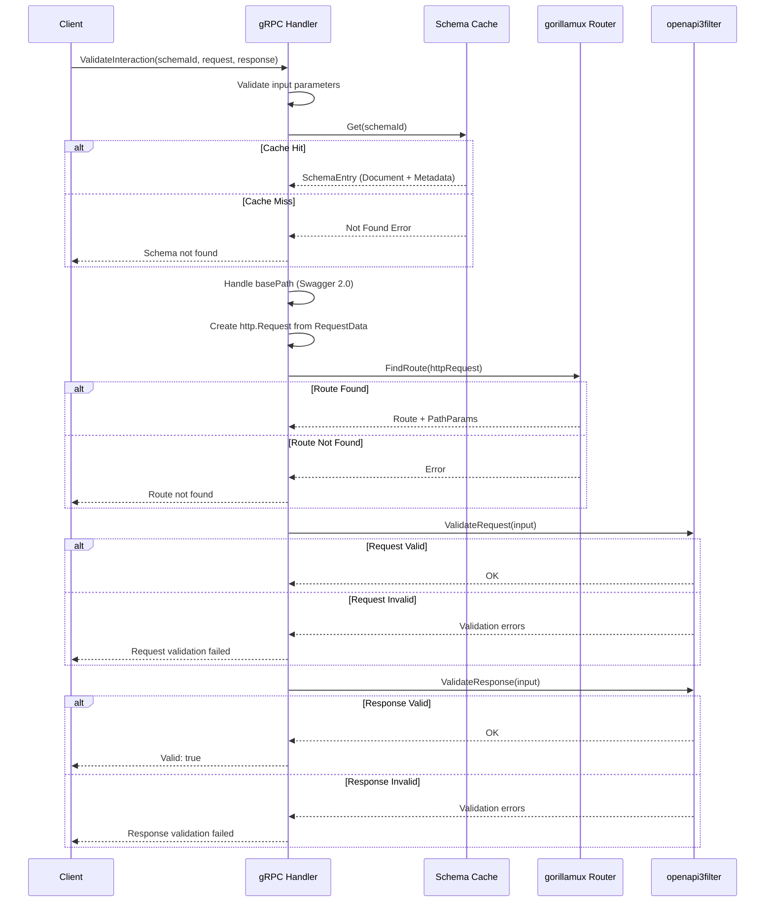

# Validation Engine Architecture

This document provides a detailed look at CVT's validation engine, including the kin-openapi integration, route matching, and validation flow.

## Overview

The validation engine is the core of CVT, responsible for:

1. Parsing and validating OpenAPI schemas (v2 and v3)
2. Converting OpenAPI v2 (Swagger) to v3 automatically
3. Matching incoming requests to schema routes
4. Validating requests against schema definitions
5. Validating responses against schema definitions

## Key Libraries

### kin-openapi

CVT uses [kin-openapi](https://github.com/getkin/kin-openapi) (v0.133.0+) as its OpenAPI parsing and validation library.

**Capabilities:**

- OpenAPI 2.0 (Swagger), 3.0, and 3.1 support
- Schema parsing from JSON/YAML
- Automatic v2 to v3 conversion
- Request and response validation
- JSON Schema validation

**Why kin-openapi:**

- Pure Go implementation (no CGO dependencies)
- Active maintenance and community
- Comprehensive OpenAPI support
- Performance-optimized

### gorillamux Router

CVT uses [gorillamux](https://github.com/getkin/kin-openapi/tree/master/routers/gorillamux) for route matching.

**Capabilities:**

- Path parameter extraction (`/users/{id}`)
- Query parameter handling
- Method matching
- Server URL resolution

## Validation Flow



## Schema Loading and Parsing

### Schema Detection

When a schema is registered, CVT automatically detects its version:

```text
Schema Content
     │
     ▼
┌─────────────────┐
│ Parse as JSON   │
└────────┬────────┘
         │
         ▼
    ┌────────────┐
    │ "swagger"  │─── "2.x" ───► Parse as OpenAPI v2
    │   field?   │               │
    └────────────┘               │
         │                       ▼
         │ No              ┌───────────────┐
         ▼                 │ Convert to v3 │
    ┌────────────┐         │ (openapi2conv)│
    │ "openapi"  │         └───────────────┘
    │   field?   │
    └────────────┘
         │
         │ "3.x"
         ▼
    Parse as OpenAPI v3
         │
         ▼
    Validate Document
         │
         ▼
    Store in Cache
```

### OpenAPI v2 to v3 Conversion

CVT automatically converts Swagger 2.0 schemas to OpenAPI 3.0 using `openapi2conv.ToV3()`:

**What gets converted:**

- `swagger: "2.0"` → `openapi: "3.0.0"`
- `basePath` → `servers[].url` path component
- `host` → `servers[].url` host component
- `definitions` → `components/schemas`
- `parameters` definitions → `components/parameters`
- Response `schema` → `content/application/json/schema`

**basePath handling:**

When validating requests against converted v2 schemas, CVT strips the basePath from incoming request paths:

```text
Swagger 2.0:        basePath: "/api/v1"
Converted to:       servers: [{url: "http://localhost/api/v1"}]
Incoming request:   /api/v1/users/123
Stripped path:      /users/123  (used for route matching)
```

## Route Matching

### Route Matching Algorithm

```text
1. Create http.Request from RequestData
   - Method: from request
   - URL: baseURL + path (with basePath stripped if needed)
   - Headers: from request
   - Body: from request (if present)

2. Create gorillamux Router from OpenAPI document
   - Server URLs temporarily modified (path components removed)
   - All paths and operations registered

3. FindRoute(request)
   - Match method (GET, POST, etc.)
   - Match path template (/users/{id} matches /users/123)
   - Extract path parameters ({id} → "123")

4. Return Route + PathParams
```

### Server URL Handling

For schemas with server URLs containing path components, CVT temporarily modifies them for routing:

```text
Original:  servers: [{url: "https://api.example.com/v1"}]
Modified:  servers: [{url: "https://api.example.com"}]
           (path stripped during route matching only)
Restored:  Original servers restored after routing
```

## Request Validation

Request validation checks the following components:

### Path Parameters

```text
Schema:    /users/{id}
Request:   /users/123

Validation:
- Parameter "id" exists in path
- Value "123" matches schema type (e.g., integer)
- Value satisfies any constraints (min, max, pattern)
```

### Query Parameters

```text
Schema:    parameters: [{name: "limit", in: "query", schema: {type: integer}}]
Request:   /users?limit=10

Validation:
- Required parameters present
- Types match (string to integer conversion)
- Enum values valid
- Format constraints satisfied
```

### Headers

```text
Schema:    parameters: [{name: "X-Request-ID", in: "header", required: true}]
Request:   headers: {"X-Request-ID": "abc123"}

Validation:
- Required headers present
- Header values match schema types
```

### Request Body

```text
Schema:    requestBody: {content: {"application/json": {schema: {...}}}}
Request:   body: {"name": "Alice", "email": "alice@example.com"}

Validation:
- Content-Type matches (application/json)
- Body parses as valid JSON
- All required properties present
- Property types match schema
- Additional properties handled per schema setting
```

## Response Validation

Response validation checks:

### Status Code

```text
Schema:    responses: {"200": {...}, "404": {...}}
Response:  statusCode: 200

Validation:
- Status code defined in schema responses
- Or matches default response if defined
```

### Response Headers

```text
Schema:    responses: {"200": {headers: {"X-Rate-Limit": {...}}}}
Response:  headers: {"X-Rate-Limit": "100"}

Validation:
- Required headers present
- Header values match schema
```

### Response Body

```text
Schema:    responses: {"200": {content: {"application/json": {schema: {...}}}}}
Response:  body: {"id": 1, "name": "Alice"}

Validation:
- Content-Type matches
- Body structure matches schema
- All required properties present
- Property types correct
```

## Error Categorization

Validation errors are categorized for easier debugging and metrics:

| Category           | Description                | Example                              |
| ------------------ | -------------------------- | ------------------------------------ |
| `input_validation` | Invalid RPC parameters     | Empty schema ID, invalid HTTP method |
| `schema_not_found` | Schema not in cache        | Schema "foo" not registered          |
| `route_not_found`  | No matching route          | GET /unknown not in schema           |
| `request_invalid`  | Request validation failed  | Missing required parameter           |
| `response_invalid` | Response validation failed | Wrong response body type             |

### Error Message Structure

Validation errors include detailed information:

```text
Request validation error:
  "parameter \"id\" in path: value \"abc\" is not a valid integer"

Response validation error:
  "response body: property \"email\" is required"
```

## Producer vs Consumer Validation

CVT supports two validation modes:

### Consumer Validation (ValidateInteraction)

Validates both request and response:

```text
Consumer Test:
  1. Send request to producer API
  2. Receive response
  3. Validate request matches schema (what I sent)
  4. Validate response matches schema (what I received)
```

**Use case:** Verify your HTTP client code communicates correctly with upstream APIs.

### Producer Validation (ValidateProducerResponse)

Validates response only:

```text
Producer Test:
  1. Call handler with test request
  2. Get handler response
  3. Validate response matches schema (what I return)
```

**Use case:** Verify your API handlers return spec-compliant responses.

## Implementation Notes

Key implementation files:

| File                                     | Purpose                  |
| ---------------------------------------- | ------------------------ |
| `server/cvtservice/validator_service.go` | Main validation logic    |
| `server/cvtservice/validation_utils.go`  | Input validation helpers |
| `server/cvtservice/cache.go`             | Schema caching           |

### Validation Configuration

The kin-openapi validation can be customized. CVT uses default settings:

- Request body required if defined in schema
- Unknown query parameters allowed
- Response body validated when present
- Security requirements not enforced (handled separately via API keys)

## In Roadmap

The following validation features are planned but not yet implemented:

- **Custom validation rules**: User-defined validation beyond OpenAPI spec
- **Partial validation**: Validate only specific parts of request/response
- **Async validation**: Non-blocking validation for high-throughput scenarios

---

## Related Documentation

- **[Architecture Overview](./index.md)** - System architecture
- **[Storage Layer](./storage-layer.md)** - Schema caching details
- **[API Reference](../api.mdx)** - gRPC API documentation
