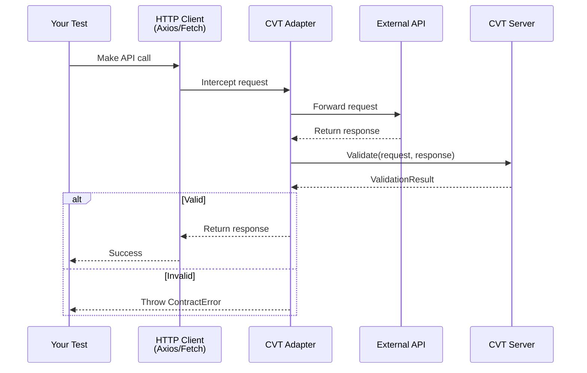
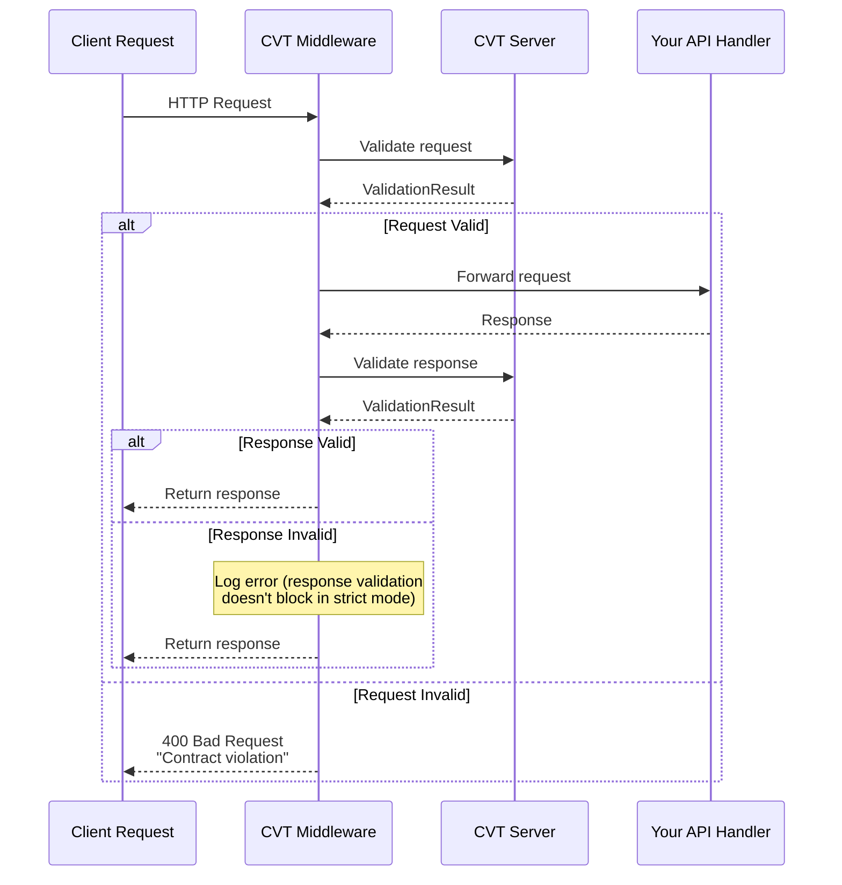

# How CVT Works

This document contains sequence diagrams showing the runtime flow during consumer and producer testing.

## Consumer Testing: Validating Your API Calls

When you use a CVT adapter (Axios, Fetch, Requests), it intercepts your HTTP calls and validates them against the upstream API's contract:



**What happens:**

1. Your test makes an HTTP call through the wrapped client
2. The adapter forwards the request to the real API
3. After receiving the response, the adapter sends both request and response to CVT
4. CVT validates against the registered OpenAPI schema
5. If invalid, the adapter throws an error—your test fails with a clear contract violation message

## Producer Testing: Validating Incoming Requests

When you add CVT middleware to your server, it validates all incoming requests before they reach your handlers:



**What happens:**

1. A client sends an HTTP request to your API
2. The middleware validates the request against your OpenAPI schema
3. If invalid (strict mode), the client receives a 400 error—your handler never executes
4. If valid, your handler processes the request and returns a response
5. The middleware validates your response (logs errors but doesn't block)

## Inside the Middleware

```text
┌───────────────────────────────────────────────────────────────┐
│                  Inside the CVT Middleware                    │
├───────────────────────────────────────────────────────────────┤
│                                                               │
│   Request                                                     │
│      │                                                        │
│      ▼                                                        │
│   Validate request against schema                             │
│      │                                                        │
│      ├── Invalid + strict mode ──► Return 400 (handler skipped)
│      │                                                        │
│      ▼                                                        │
│   Call your handler                                           │
│      │                                                        │
│      ▼                                                        │
│   Validate response against schema                            │
│      │                                                        │
│      ├── Invalid ──► Log error (response already sent)        │
│      │                                                        │
│      ▼                                                        │
│   Response                                                    │
│                                                               │
└───────────────────────────────────────────────────────────────┘
```

Request validation can block (in strict mode), but response validation can only log—the response has already been sent to the client.

## Producer Contract Testing Architecture

This diagram shows how CVT middleware in your project communicates with the CVT Server:

```text
┌─────────────────────────────────────────────────────────────────────────────┐
│                     Producer Contract Testing Architecture                   │
├─────────────────────────────────────────────────────────────────────────────┤
│                                                                             │
│   ┌─────────────────────────────────────┐    ┌─────────────────────────┐   │
│   │          YOUR PROJECT               │    │      CVT SERVER         │   │
│   │                                     │    │                         │   │
│   │  ┌───────────────────────────────┐  │    │  ┌───────────────────┐  │   │
│   │  │     Your HTTP Server          │  │    │  │  gRPC Service     │  │   │
│   │  │     (Express/Gin/FastAPI)     │  │    │  │                   │  │   │
│   │  │                               │  │    │  │  • Schema Cache   │  │   │
│   │  │  ┌─────────────────────────┐  │  │    │  │  • OpenAPI Parser │  │   │
│   │  │  │   CVT Middleware        │◄─┼──┼────┼──►  • Validator      │  │   │
│   │  │  │   (provided by SDK)     │  │  │    │  │                   │  │   │
│   │  │  └────────────┬────────────┘  │  │    │  └───────────────────┘  │   │
│   │  │               │               │  │    │                         │   │
│   │  │  ┌────────────▼────────────┐  │  │    │  Port: 9550 (gRPC)    │   │
│   │  │  │   Your Route Handlers   │  │  │    │                         │   │
│   │  │  │   (your business logic) │  │  │    └─────────────────────────┘   │
│   │  │  └─────────────────────────┘  │  │                                  │
│   │  └───────────────────────────────┘  │                                  │
│   │                                     │                                  │
│   │  Port: 3000/8080 (your app)        │                                  │
│   └─────────────────────────────────────┘                                  │
│                                                                             │
└─────────────────────────────────────────────────────────────────────────────┘
```

**Flow:**

1. Client sends request to YOUR server
2. CVT Middleware intercepts the request
3. Middleware calls CVT Server to validate request against schema
4. If valid → request continues to your handler; if invalid (strict mode) → 400 returned, handler skipped
5. Your handler returns response
6. Middleware validates response (logs only, can't block)

### Why Use Middleware?

- **Centralized validation**: You don't want validation logic scattered across every route handler
- **Complete coverage**: Centralized enforcement ensures no endpoint is missed
- **Easy mode switching**: Changing from shadow → warn → strict is a config change, not a code change

### Who Provides the Middleware?

CVT SDK provides the middleware for your framework. You just import and use it—no custom validation code needed:

```typescript
// Express.js - one line to validate ALL incoming requests
app.use(createCVTMiddleware({ schemaId: "my-api" }));
```

### When Is It Used?

- Every incoming HTTP request passes through the middleware
- Runs in production (not just tests) for runtime contract enforcement

## Middleware Support

CVT provides middleware for all supported SDKs and frameworks:

| Language | Frameworks         |
| -------- | ------------------ |
| Node.js  | Express, Fastify   |
| Python   | FastAPI, Flask     |
| Go       | net/http, Gin, Chi |
| Java     | Spring, Servlet    |
